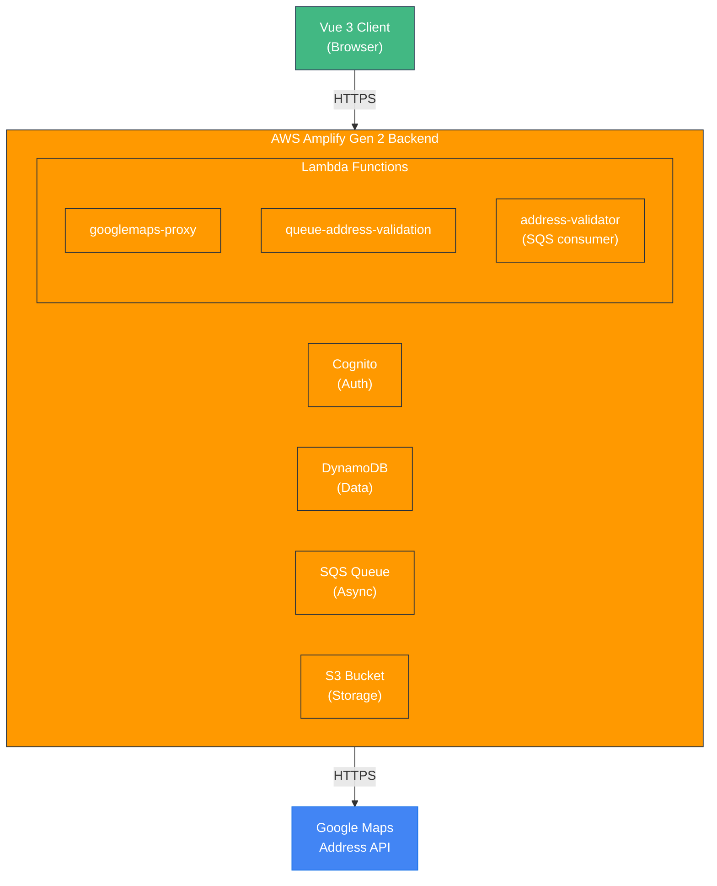

# Architecture Documentation

## Table of Contents

> **Note**: TOC links work on GitHub and most markdown viewers, but not in macOS Finder's Quick Look preview. For best experience, view this file on GitHub or use a markdown viewer that supports anchor links (e.g., Obsidian, VS Code, or a web browser).

- [Overview](#overview)
  - [Primary Goal](#primary-goal)
  - [Core Purpose](#core-purpose)
- [Technology Stack](#technology-stack)
  - [Frontend](#frontend)
  - [Backend](#backend)
  - [External Services](#external-services)
- [System Architecture](#system-architecture)
  - [High-Level Architecture](#high-level-architecture)
  - [Frontend Architecture](#frontend-architecture)
  - [Backend Architecture](#backend-architecture)
- [Data Models](#data-models)
  - [DynamoDB Schema](#dynamodb-schema-via-amplify-data)
  - [Authorization Rules](#authorization-rules)
- [Key Features & Workflows](#key-features--workflows)
  - [Recipient Management](#1-recipient-management)
  - [Address Validation](#2-address-validation)
  - [Access Code Management](#3-access-code-management)
  - [User Invitation & Registration Flow](#4-user-invitation--registration-flow)
  - [Newsletter Management](#5-newsletter-management)
  - [Newsletter Viewing & Downloading (Viewer Access)](#6-newsletter-viewing--downloading-viewer-access)
    - [Card Image Format Recommendations](#card-image-format-recommendations)
    - [Newsletter Viewing & Downloading UX](#newsletter-viewing--downloading-ux)
    - [PDF Security & Copy Protection](#pdf-security--copy-protection)
  - [User Management (Disable/Delete)](#7-user-management-disabledelete)
- [Security & Authentication](#security--authentication)
  - [User Types](#user-types)
  - [Authentication](#authentication)
  - [Password Reset Flow](#password-reset-flow)
  - [Authorization](#authorization)
  - [API Key Management](#api-key-management)
  - [CORS](#cors)
  - [Session Management](#session-management)
  - [Rate Limiting & Abuse Prevention](#rate-limiting--abuse-prevention)
  - [Account Recovery](#account-recovery)
  - [Lost Email Access Recovery](#lost-email-access-recovery)
- [Data & Privacy](#data--privacy)
  - [Data Retention Policy](#data-retention-policy)
  - [Privacy Policy & Data Privacy Statement](#privacy-policy--data-privacy-statement)
  - [GDPR/Privacy Compliance Considerations](#gdprprivacy-compliance-considerations)
  - [Data Backup & Recovery](#data-backup--recovery)
  - [PII (Personally Identifiable Information) Handling](#pii-personally-identifiable-information-handling)
  - [Audit Logging](#audit-logging)
- [External Integrations](#external-integrations)
  - [Google Maps Address Validation API](#google-maps-address-validation-api)
  - [AWS Services Integration](#aws-services-integration)
- [Deployment & Configuration](#deployment--configuration)
  - [Development](#development)
  - [Production Deployment](#production-deployment)
  - [AWS Profile](#aws-profile)
  - [Environment Configuration](#environment-configuration)
  - [Required SSM Parameters](#required-ssm-parameters)
- [File Structure](#file-structure)
  - [Root Directory](#root-directory)
  - [Key Configuration Files](#key-configuration-files)
- [Development Patterns](#development-patterns)
  - [TypeScript](#typescript)
  - [State Management](#state-management)
  - [Error Handling](#error-handling)
  - [Code Organization](#code-organization)
- [Performance Considerations](#performance-considerations)
  - [Frontend](#frontend-1)
  - [Backend](#backend-1)
  - [Scalability](#scalability)
- [Monitoring & Debugging](#monitoring--debugging)
  - [Logging](#logging)
  - [Debugging Tools](#debugging-tools)
  - [Common Debugging Commands](#common-debugging-commands)
- [Known Limitations & Future Considerations](#known-limitations--future-considerations)
  - [Current Limitations](#current-limitations)
  - [Potential Enhancements](#potential-enhancements)
  - [Technical Debt](#technical-debt)
- [Dependencies](#dependencies)
  - [Critical Dependencies](#critical-dependencies)
  - [Development Dependencies](#development-dependencies)
- [Conclusion](#conclusion)

---

## Overview

**kellish-yir-website** is a Year-in-Review newsletter management system that enables administrators to manage recipients, validate addresses, generate access codes, and distribute newsletters. The application is built as a full-stack serverless web application using Vue 3, AWS Amplify Gen 2, and modern cloud infrastructure.

### Primary Goal

The primary goal of the site is to allow **invited users to register for access** and, once registered, access the current and past family year-in-review newsletters. The system uses a unique invitation link model where each recipient receives a personalized registration URL that enables them to create an account and gain access to the newsletter content.

### Core Purpose

- **User Registration & Access**: Invited users register via unique registration links to access current and past newsletters
- **Recipient Management**: CRUD operations for newsletter recipients with address validation
- **Address Validation**: Automated validation using Google Maps Address Validation API (US and international)
- **Access Control**: Unique access code generation and management for newsletter access
- **Newsletter Distribution**: Management of newsletters and access links for recipients
- **Bulk Operations**: Import recipients from Excel/CSV, bulk code generation, bulk deletion

---

## Technology Stack

### Frontend

- **Framework**: Vue 3 (Composition API)
- **UI Library**: PrimeVue 4.3.5 with Aura theme
- **Styling**: Tailwind CSS 3.4.17 + PrimeFlex 4.0.0
- **State Management**: Pinia 3.0.1
- **Routing**: Vue Router 4.5.0
- **Build Tool**: Vite 6.2.4
- **TypeScript**: 5.8.3 (strict mode)
- **PDF Processing**: PDF.js 5.3.31 (for thumbnail generation)

### Backend

- **Framework**: AWS Amplify Gen 2
- **Runtime**: Node.js (Lambda functions)
- **Database**: Amazon DynamoDB (via Amplify Data)
- **Authentication**: Amazon Cognito (User Pools)
- **Storage**: Amazon S3
- **Compute**: AWS Lambda
- **Queue**: Amazon SQS (for async address validation)
- **Infrastructure as Code**: AWS CDK (via Amplify Gen 2)

### External Services

- **Google Maps Address Validation API**: Address validation and standardization
- **AWS Systems Manager Parameter Store**: Secure storage for API keys

---

## System Architecture

### High-Level Architecture



### Frontend Architecture

#### Application Structure

```
src/
├── main.ts                 # Application entry point
├── App.vue                 # Root component with navigation
├── amplify-config.ts       # Amplify configuration loader
├── router/
│   └── index.ts           # Vue Router with auth guards
├── stores/
│   ├── authStore.ts       # Authentication state (Pinia)
│   └── counter.ts         # Example store
├── views/
│   ├── Home.vue           # Public home page
│   ├── Login.vue          # Authentication page
│   ├── NewsletterAdmin.vue # Newsletter management
│   └── RecipientAdmin.vue  # Recipient management (main feature)
├── components/            # Reusable Vue components
├── utils/
│   ├── googlemaps-validator.ts    # Address validation client
│   ├── address-validation-queue.ts # Queue integration
│   ├── access-codes.ts            # Access code utilities
│   ├── pdfWorker.ts               # PDF.js worker setup
│   ├── pdfThumbnail.ts            # Thumbnail generation
│   ├── thumbnailGenerator.ts     # Thumbnail utilities
│   └── inactivityTracker.ts       # Session management
└── assets/                # Static assets and styles
```

#### Key Frontend Patterns

1. **Composition API**: All components use Vue 3 Composition API with `<script setup>`
2. **Type Safety**: Full TypeScript coverage with strict mode
3. **Component Library**: PrimeVue components for consistent UI
4. **Dark Mode**: System-aware dark mode via Tailwind CSS
5. **Responsive Design**: Mobile-first approach with Tailwind utilities

### Backend Architecture

#### Amplify Gen 2 Structure

```
amplify/
├── backend.ts              # Main backend definition
├── auth/
│   └── resource.ts        # Cognito configuration
├── data/
│   └── resource.ts        # DynamoDB schema (GraphQL)
├── storage/
│   └── resource.ts        # S3 bucket configuration
└── functions/
    ├── googlemaps-proxy/
    │   ├── handler.ts     # Google Maps API proxy
    │   └── resource.ts
    ├── queue-address-validation/
    │   ├── handler.ts     # Queue validation requests
    │   └── resource.ts
    └── address-validator/
        ├── handler.ts     # Process validation queue
        └── resource.ts
```

#### Lambda Functions

1. **googlemaps-proxy**

   - **Purpose**: Proxy requests to Google Maps Address Validation API
   - **Trigger**: Function URL (public, no auth)
   - **Permissions**: SSM read access for API key
   - **CORS**: Handled in handler code

2. **queue-address-validation**

   - **Purpose**: Queue address validation requests to SQS
   - **Trigger**: Function URL (public, no auth - auth handled in app)
   - **Permissions**: SQS send, DynamoDB read/write
   - **Input**: Recipient ID(s) to validate

3. **address-validator**
   - **Purpose**: Process address validation from SQS queue
   - **Trigger**: SQS event source (batch size: 10)
   - **Permissions**: SSM read, DynamoDB read/write
   - **Process**: Validates addresses via Google Maps, updates DynamoDB

#### Data Flow: Address Validation

```
1. User enters/edits address in RecipientAdmin.vue
2. Frontend calls queue-address-validation Lambda (Function URL)
3. Lambda queues message to SQS with recipient ID
4. SQS triggers address-validator Lambda (batch processing)
5. address-validator:
   a. Fetches recipient from DynamoDB
   b. Calls googlemaps-proxy Lambda
   c. googlemaps-proxy calls Google Maps API
   d. address-validator processes response
   e. Updates DynamoDB with validation results
6. Frontend polls/refreshes to see updated status
```

---

## Data Models

### DynamoDB Schema (via Amplify Data)

#### Recipient Model

```typescript
{
  id: string (auto-generated)
  title?: string
  firstName: string (required)
  secondName?: string
  lastName: string (required)
  suffix?: string
  mailingName?: string  // Override for envelope/label
  address1?: string
  address2?: string
  city?: string
  state?: string
  zipcode?: string
  country?: string
  email?: string
  wantsPaper: boolean (default: true)
  sendCard: boolean (default: true)
  accessCode?: string
  accessCodeUsed: boolean (default: false)
  accessCodeUsedAt?: datetime
  // Address validation fields
  addressValidationStatus: string (default: 'pending')
    // Values: 'pending', 'queued', 'valid', 'invalid', 'error', 'overridden'
  addressValidationMessage?: string
  addressValidatedAt?: datetime
  validatedAddress1?: string
  validatedAddress2?: string
  validatedCity?: string
  validatedState?: string
  validatedZipcode?: string
  validatedCountry?: string
  accessLinks: hasMany(NewsletterAccessLink)
  createdAt: datetime (required)
  updatedAt: datetime (required)
}
```

#### Newsletter Model

```typescript
{
  id: string (auto-generated)
  title: string (required)
  year: integer (required)
  hasCardImage?: boolean
  cardWidthIn?: float
  cardHeightIn?: float
  pdfWidthIn?: float
  pdfHeightIn?: float
  pdfPageCount?: integer
  accessLinks: hasMany(NewsletterAccessLink)
}
```

#### AccessCode Model

```typescript
{
  id: string (auto-generated)
  code: string (required)  // Format: "KEL-XXXX-XXXX"
  recipientName: string (required)
  recipientAddress?: string
  used: boolean (default: false)
  usedAt?: datetime
  usedBy?: string  // NewsletterUser ID
  createdAt: datetime (required)
  expiresAt?: datetime  // Optional explicit expiration date (extended annually for bulk invitations)
  active: boolean (default: true)  // Can be deactivated if recipient removed from mailing list
  invitedBy?: string  // NewsletterUser ID of Admin/Inviter who created this invitation (null for bulk invitations, set for on-demand)
  invitationType?: string  // 'bulk' | 'on-demand' - distinguishes bulk mailing list invitations from on-demand invitations
  // Expiration logic:
  // - Bulk invitations: 1 year from generation or last extension (extended annually in December)
  // - On-demand invitations: 6 months from generation
  // - If expiresAt not set, calculate from createdAt + validity period
}
```

#### NewsletterAccessLink Model

```typescript
{
  id: string (auto-generated)
  uniqueUrlToken: string (required)
  used: boolean (default: false)
  newsletterId: string (required)
  recipientId: string (required)
  newsletter: belongsTo(Newsletter)
  recipient: belongsTo(Recipient)
}
```

#### NewsletterUser Model

```typescript
{
  id: string (auto-generated)
  email: string (required)
  accessCode: string (required)
  registeredAt: datetime (required)
  lastLoginAt?: datetime
  accessLevel: string (default: 'viewer')  // 'viewer' | 'admin'
  active: boolean (default: true)  // Can be deactivated by admin/inviter
  deactivatedAt?: datetime  // When user was deactivated
  deactivatedBy?: string  // Admin/Inviter user ID who deactivated
  deactivationReason?: string  // Optional reason for deactivation
}
```

### Authorization Rules

- **Recipient, Newsletter, AccessCode, NewsletterAccessLink**: Admin group only
- **NewsletterUser**:
  - Admin group: Full access (read, update, disable, delete)
  - Inviter group: Read access + disable (cannot delete)
  - Owner: Self-access (read own record)

---

## Key Features & Workflows

### 1. Recipient Management

**Location**: `src/views/RecipientAdmin.vue`

**Features**:

- CRUD operations (Create, Read, Update, Delete)
- Bulk import from Excel/CSV
- Search and filter (name, email, city, state, access code)
- Status filtering (access code status, address validation status)
- **Inviter filtering**: Filter recipients by inviter (e.g., "Alec's friends" vs "Shannon's friends")
- Bulk operations (delete, regenerate access codes - automatically skips recipients who have already registered)
- Address validation integration
- Dark mode support

**Workflow - Add Recipient**:

1. User clicks "Add Recipient"
2. Form dialog opens
3. User enters recipient details
4. If address provided, validation can be triggered
5. On save, recipient created in DynamoDB
6. If address exists, validation queued automatically

**Workflow - Edit Recipient**:

1. User clicks "Edit" on a recipient row
2. Form dialog opens with current recipient data
3. User can modify recipient details:
   - Name, address, contact information
   - **Inviter Assignment**: Admin users can change the `invitedBy` field to reassign the recipient to a different Inviter
     - Dropdown/selector shows all available Inviter users (members of `Inviter` Cognito group)
     - Allows changing from one inviter to another (e.g., from "Alec" to "Shannon")
     - Updates the associated `AccessCode.invitedBy` field
     - Useful for organizational purposes (e.g., reassigning recipients between family members)
4. If address is modified, validation can be triggered
5. On save, recipient updated in DynamoDB
6. If address changed, validation queued automatically

**Workflow - Import Recipients**:

1. User clicks "Import CSV"
2. File picker opens
3. File parsed (XLSX library)
4. Preview shown with validation
5. User confirms import
6. Recipients created in batch
7. Address validation queued for each recipient with address

### 2. Address Validation

**Architecture**: Asynchronous queue-based processing

**Status Flow**:

```
pending → queued → (valid | invalid | error)
```

**Validation Logic**:

- **US Addresses**: Uses USPS DPV confirmation codes ("Y", "D", "S" = deliverable)
- **International Addresses**: Uses Google Maps verdict
- **SUB_PREMISE** addresses (apartments): Considered deliverable
- Auto-fills missing fields (zipcode, state, city, country)

**UI Indicators**:

- ✓ Valid (green)
- ⚠️ Invalid (yellow)
- ❌ Error (red)
- ⏳ Queued (blue, pulsing)
- ? Pending (gray)

### 3. Access Code Management

**Format**: `KEL-XXXX-XXXX` (e.g., "KEL-A1B2-C3D4")

**Generation**:

- Unique codes generated per recipient
- Stored in both `Recipient.accessCode` and `AccessCode.code`
- Bulk generation available

**Usage Tracking**:

- `accessCodeUsed` flag
- `accessCodeUsedAt` timestamp
- Links to `NewsletterUser` who used it (`usedBy`)
- **Inviter Tracking**:
  - `invitedBy`: NewsletterUser ID of Admin/Inviter who created the invitation
  - `invitationType`: `'bulk'` for mailing list invitations, `'on-demand'` for individual invitations
  - **Use Case**: Track which Inviter (e.g., "Alec's friends" vs "Shannon's friends") invited each recipient
  - **Reporting**: Admin users can filter and view recipients by inviter
  - **Reassignment**: Admin users can change the inviter when editing a recipient (updates `AccessCode.invitedBy` field)

**Validity Period**:

- **Bulk Invitations (Method 1)**: **1 year** from generation or last extension
  - Initial generation: Codes generated when mailing list is imported (e.g., for 2025 YIR)
  - Annual extension: Each December when sending new YIR, unused codes have their expiration extended by 1 year
  - Rationale: Newsletters are sent annually in December, recipients may not register immediately
  - Allows recipients to use the same code across multiple years if they haven't registered yet
  - Prevents timing edge cases (codes aren't deleted/replaced during mailing season)
- **On-Demand Invitations (Method 2)**: **6 months** from generation date
  - Rationale: Shared directly with users, typically used more quickly
  - Shorter period reduces security risk for codes shared via email/text
  - Still provides reasonable time for users to register

**Code Lifecycle Management**:

- **One Active Code Per Recipient**: Each recipient should have only one active (unused) access code at a time
- **Annual YIR Workflow (December)**:
  1. **Generate New Codes**: For recipients who don't have a code yet (new recipients)
  2. **Extend Expiration**: For recipients with unused codes, extend expiration by 1 year (same code, new expiration)
  3. **Skip Registered**: Recipients who already registered (have a used code) don't receive registration link in mailing
  4. **Deactivate Removed**: Recipients removed from mailing list have their codes deactivated
- **Code Extension Process**:
  - Update `AccessCode.expiresAt` (or calculate from `createdAt` + extension period)
  - Same code is reused, just with extended validity
  - No deletion/replacement needed, avoiding timing edge cases
- **Used Codes**: Once a code is used (`accessCodeUsed = true`), it cannot be reused and recipient doesn't need new codes
- **Deactivated Codes**: Codes for recipients removed from mailing list are marked as inactive/deactivated

**Expiration Behavior**:

- Expired codes cannot be used for registration
- Users receive clear error message: "This invitation link has expired. Please contact an administrator for a new invitation."
- Admin users can regenerate codes for expired invitations (if recipient hasn't registered yet) - replaces old code
- Once a code is used (`accessCodeUsed = true`), it cannot be reused regardless of expiration

**Registration Validation Logic**:

During registration, the system performs the following validation checks in order:

1. **Code Existence**: Verify the access code exists in the database
   - If not found: Error message: "Invalid invitation link. Please check the link and try again, or contact an administrator for assistance."
2. **Code Active Status**: Verify the code is active (`active = true`)
   - If inactive: Error message: "This invitation link has been deactivated. Please contact an administrator for a new invitation."
3. **Code Expiration**: Verify the code has not expired
   - Check `expiresAt` if set, otherwise calculate from `createdAt` + validity period (1 year for bulk, 6 months for on-demand)
   - If expired: Error message: "This invitation link has expired. Please contact an administrator for a new invitation."
4. **Code Reuse Prevention**: Verify the code has not been used (`accessCodeUsed = false`)
   - If already used: Error message: "This invitation link has already been used. Each invitation link can only be used once. Please contact an administrator if you need access."
   - This check prevents any reuse, even if the code is still within its validity period

**Error Handling for Used Codes**:

- **User Experience**: When a user attempts to register with an already-used code, they receive a clear error message indicating the code has been used
- **Audit Trail**: The system maintains `accessCodeUsedAt` and `usedBy` (NewsletterUser ID) for audit purposes
- **Recovery**: Users who need access but have a used code must contact an Admin or Inviter user to generate a new invitation link

**Admin Code Regeneration Capability**:

- **Regeneration Functionality**: Admin users can regenerate access codes for recipients who have not yet registered
- **Use Cases**:
  - Compromised code: If a code was shared inappropriately or compromised, regenerate to invalidate the old code
  - Security: Invalidate old codes and issue new ones for security purposes
- **Regeneration Restrictions**:
  - **Single Recipient**: Regenerate button is disabled for recipients who have already registered (`accessCodeUsed = true`)
  - **Bulk Regeneration**: When regenerating codes for multiple recipients, the system automatically skips recipients who have already registered
  - **Rationale**: Once a recipient has registered, they have an account and don't need a new code. The old code is no longer needed for registration purposes.
- **Regeneration Process**:
  1. Admin navigates to recipient management
  2. For single recipient: Clicks regenerate button (refresh icon) next to recipient who hasn't registered
  3. For bulk: Selects multiple recipients and clicks "Generate Codes" button
  4. System generates new unique code, sets `accessCodeUsed = false`, clears `accessCodeUsedAt`
  5. Old code is invalidated (cannot be used for registration)
  6. User feedback: Alert shows how many codes were regenerated and how many recipients were skipped (if any)
- **Security Consideration**: Regeneration action should be logged for audit purposes
- **Note**: Regenerating a code does not affect existing user accounts. If a recipient already registered with the old code, they retain their account access. The old code simply cannot be used for new registrations.

**Implementation Notes**:

- All validation checks performed during registration validation (before account creation)
- Validation occurs atomically to prevent race conditions
- `AccessCode.expiresAt` or calculated from `createdAt` + validity period
- Expired codes remain in database for audit purposes but are marked as invalid
- Used codes remain in database for audit purposes and cannot be reused
- Annual extension process (December): Update `expiresAt` for unused codes, extending by 1 year
- Deactivation: Set `active = false` for recipients removed from mailing list
- Code extension avoids timing edge cases (no deletion during mailing season)
- Same code can be used across multiple years if recipient hasn't registered yet

### 4. User Invitation & Registration Flow

**Primary Use Case**: Enable invited users to register and access current and past year-in-review newsletters.

#### Invitation Methods

**Method 1: Bulk Invitation for Mailing List Recipients**

**Initial Setup (First Year, e.g., 2025)**:

1. **Import Mailing List**: Administrators import the mailing list (recipients who receive printed newsletters and holiday cards)
2. **Generate Invite URLs**: System generates a unique registration link for each recipient (none exist yet)
   - **Inviter Tracking**: For bulk invitations:
     - `invitedBy`: Set to Admin user ID (or null if generated by system)
     - `invitationType`: Set to `'bulk'` to distinguish from on-demand invitations
3. **Include in Mailing**: The unique registration link is included in the printed newsletter mailing along with registration instructions
4. **Registration**: Recipients use their unique link to access the site and complete registration with minimum required information

**Annual Workflow (Each December, e.g., 2026)**:

1. **Review Mailing List**: Administrators review and update the mailing list for the new year
2. **Code Management**:
   - **New Recipients**: Generate new access codes for recipients not in the system
   - **Unregistered Recipients**: Extend expiration date by 1 year for recipients with unused codes (same code, extended validity)
   - **Registered Recipients**: Skip - they already have accounts and don't need registration links
   - **Removed Recipients**: Deactivate codes for recipients removed from the mailing list
3. **Include in Mailing**: Registration links are included in the printed newsletter mailing
   - Only recipients with active, unused codes receive registration links
   - Registered recipients receive newsletters but no registration link
4. **Registration**: Recipients can use their link (same code if they received it before, or new code if they're new)

**Method 2: On-Demand Invitation for New Users**

1. **Generate Unique Link**: Admin or Inviter users can generate a unique registration link for individuals not in the mailing list (e.g., children's friends)
   - **Inviter Tracking**: When an Inviter user generates an on-demand invitation, the system records:
     - `invitedBy`: NewsletterUser ID of the Inviter who created the invitation
     - `invitationType`: Set to `'on-demand'` to distinguish from bulk invitations
   - **Use Case**: Allows tracking which Inviter (e.g., "Alec's friends" vs "Shannon's friends") invited each recipient
   - **Reporting**: Admin users can view and filter recipients by inviter to see who invited whom
2. **Share Link**: The link is shared directly with the new user (via email, text, etc.)
3. **Registration**: User accesses the site via the unique link and completes registration

#### Registration Process

1. **Access via Unique Link**: User clicks their personalized registration URL (format: `https://domain.com/register?code=KEL-XXXX-XXXX`)
2. **Identity Validation**: User provides validation information (name + zip code for paper recipients, or name + email for on-demand)
3. **Account Creation**: User provides email and password to create account
4. **Email Verification**: User verifies email address via code sent to their email
5. **Access Granted**: Once registered and verified, user can access all current and past newsletters

#### Registration Error Handling

**Error Scenarios & User Experience**:

1. **Invalid Access Code**:

   - **Scenario**: Access code not found in database (typo, invalid format, or code deleted)
   - **Error Message**: "Invalid invitation link. Please check the link and try again, or contact an administrator for assistance."
   - **User Action**: User can retry with correct code or contact admin
   - **Recovery**: Admin/Inviter can generate new invitation link

2. **Expired Access Code**:

   - **Scenario**: Access code has passed its expiration date
   - **Error Message**: "This invitation link has expired. Please contact an administrator for a new invitation."
   - **User Action**: User must contact admin/inviter for new invitation
   - **Recovery**: Admin can regenerate code for recipient (if they haven't registered yet) or extend expiration for unused codes

3. **Deactivated Access Code**:

   - **Scenario**: Access code was deactivated (recipient removed from mailing list)
   - **Error Message**: "This invitation link has been deactivated. Please contact an administrator for a new invitation."
   - **User Action**: User must contact admin/inviter
   - **Recovery**: Admin/Inviter can reactivate code or generate new one

4. **Already-Used Access Code**:

   - **Scenario**: Access code was already used to register another account
   - **Error Message**: "This invitation link has already been used. Each invitation link can only be used once. Please contact an administrator if you need access."
   - **User Action**: User must contact admin/inviter
   - **Recovery**: Admin can regenerate code for recipient (if they haven't registered yet), but once registered, recipient has account access and doesn't need a new code

5. **Identity Validation Failure**:

   - **Scenario**: User provides incorrect name/zip code or name/email that doesn't match access code
   - **Error Message**: "The information you provided does not match our records. Please check your name and zip code (or email) and try again."
   - **User Action**: User can retry with correct information
   - **Retry Limit**: 3 attempts before requiring admin assistance
   - **Recovery**: After 3 failures, user must contact admin/inviter

6. **Email Already Registered**:

   - **Scenario**: User tries to register with email that's already in use
   - **Error Message**: "An account with this email address already exists. Please log in instead, or use a different email address."
   - **User Action**: User can log in with existing account or use different email
   - **Recovery**: User can use password reset if they forgot password

7. **Email Verification Code Expired**:

   - **Scenario**: User doesn't verify email within 24 hours
   - **Error Message**: "Your verification code has expired. Please request a new verification code."
   - **User Action**: User can request new verification code
   - **Resend Code**: "Resend Verification Code" button available
   - **Retry Limit**: 5 codes per hour per email (Cognito rate limit)

8. **Email Verification Code Invalid**:

   - **Scenario**: User enters incorrect verification code
   - **Error Message**: "Invalid verification code. Please check your email and try again."
   - **User Action**: User can retry with correct code
   - **Retry Limit**: 5 attempts per hour per email
   - **Recovery**: User can request new code if needed

9. **Password Requirements Not Met**:

   - **Scenario**: User's password doesn't meet Cognito password policy
   - **Error Message**: "Password must be at least 8 characters and contain uppercase, lowercase, numbers, and special characters."
   - **User Action**: User must create password meeting requirements
   - **Real-time Validation**: Frontend validates password requirements before submission

10. **Network/Server Errors**:
    - **Scenario**: API call fails due to network or server error
    - **Error Message**: "We're having trouble processing your request. Please try again in a few moments."
    - **User Action**: User can retry the operation
    - **Retry Mechanism**: Automatic retry with exponential backoff (if implemented)

**Error Message Best Practices**:

- ✅ **Clear and Actionable**: Error messages explain what went wrong and what user can do
- ✅ **User-Friendly Language**: Avoid technical jargon
- ✅ **Recovery Guidance**: Provide next steps or contact information
- ✅ **Consistent Format**: All error messages follow same format
- ✅ **No Information Leakage**: Don't reveal system internals (e.g., don't say "code not found in database")

**Retry Mechanisms**:

- **Identity Validation**: 3 attempts before requiring admin assistance
- **Email Verification Code**: Can request new code (5 codes per hour limit)
- **Network Errors**: Automatic retry with exponential backoff (optional enhancement)
- **Rate Limiting**: Clear message when rate limit exceeded, with wait time indication

**Error Logging**:

- All registration errors logged to CloudWatch Logs
- Include: error type, access code (hashed), timestamp, IP address
- Exclude: sensitive user information (passwords, full addresses)
- Used for: debugging, security monitoring, improving error messages

#### Password Reset Process

1. **Forgot Password**: User clicks "Forgot Password" link on login page
2. **Email Entry**: User enters their registered email address
3. **Verification Code**: Cognito sends a 6-digit verification code to the user's email
4. **Code Verification**: User enters the verification code from their email
5. **New Password**: User enters and confirms their new password
6. **Password Updated**: User can now log in with the new password

**Note**: Verification codes expire after 24 hours. Users can request a new code if needed.

#### User Permissions

**Viewer Users** (registered via invitation link):

- ✅ View newsletters and cards
- ✅ Download newsletters and cards
- ❌ Cannot manage recipients
- ❌ Cannot manage newsletters
- ❌ Cannot generate invite links
- ❌ Cannot access admin features
- **Access Level**: `viewer` (default in `NewsletterUser.accessLevel`)

**Inviter Users** (manually created, family members):

- ✅ All viewer permissions (view and download newsletters/cards)
- ✅ Generate recipient invite links (on-demand invitations)
- ✅ View recipient list (read-only, to see who has been invited)
- ✅ Assist with email recovery (help users who lose access to their email)
- ✅ Disable viewer users (cannot delete)
- ❌ Cannot manage recipients (create, edit, delete)
- ❌ Cannot manage newsletters
- ❌ Cannot import recipients
- ❌ Cannot delete users (only disable)
- ❌ Cannot access full admin features
- **Access Level**: Member of `Inviter` Cognito group
- **Use Case**: Family members (children, spouse) who can invite others, assist with account recovery, and manage viewer accounts but don't need full admin access

**Admin Users** (manually created):

- ✅ All viewer permissions
- ✅ All inviter permissions
- ✅ Manage recipients (CRUD operations)
- ✅ Manage newsletters (upload, edit, delete)
- ✅ Generate access codes (bulk and individual)
- ✅ Import recipients
- ✅ Disable and delete viewer users
- ✅ Access all admin features
- **Access Level**: Member of `Admin` Cognito group

#### Technical Implementation

- **Access Code**: Each recipient has a unique `accessCode` stored in the `Recipient` model
- **Registration URL**: Format: `/register?code={accessCode}`
- **User Model**: `NewsletterUser` model stores registered user information
- **Link Tracking**: `accessCodeUsed` and `accessCodeUsedAt` fields track when codes are used
- **Authorization**:
  - Registered users have `viewer` access level (default)
  - Users in `Inviter` Cognito group can generate invite links and view recipients (read-only)
  - Users in `Admin` Cognito group have full admin access
  - Viewer users can only access their own data via owner-based authorization

### 5. Newsletter Management

**Location**: `src/views/NewsletterAdmin.vue`

**Features**:

- Create/edit newsletters
- Upload PDF files
- Generate thumbnails
- Manage access links

### 6. Newsletter Viewing & Downloading (Viewer Access)

**Purpose**: Allow registered users (Viewers, Inviters, Admins) to view and download current and past year-in-review newsletters.

**Location**: `src/views/Home.vue` (or dedicated `src/views/Newsletters.vue`)

**Routes**:

- `/` (Home): Newsletter listing page for authenticated users
- `/newsletter/:id` (optional): Individual newsletter detail page

**Authorization**:

- **Access**: Any authenticated user (Viewer, Inviter, Admin)
- **Data Access**: Users can query Newsletter model (read-only for Viewers)
- **S3 Access**: Users can access newsletter PDFs via Amplify Storage (protected access)

**Features**:

1. **Newsletter Listing**:

   - Display all newsletters sorted by year (newest first)
   - Show newsletter title, year, thumbnail
   - Display card image thumbnail if available
   - Show PDF page count
   - Filter/search by year (optional)

2. **Newsletter Viewing**:

   - **In-Browser View**: Display PDF using PDF.js or browser's native PDF viewer
   - **Thumbnail Preview**: Show thumbnail before opening full PDF
   - **Card Image View**: Display holiday card image if available

3. **Newsletter Downloading**:
   - **Download PDF**: Download newsletter PDF file
   - **Download Card**: Download card image if available
   - **File Names**: Descriptive filenames (e.g., `Kellish-Year-in-Review-2024.pdf`)

**Technical Implementation**:

**Data Access**:

```typescript
// Query all newsletters (read-only for viewers)
const newsletters = await client.models.Newsletter.list({
  // No filters - viewers see all newsletters
})
```

**S3 File Access**:

```typescript
// Get signed URL for newsletter PDF
const pdfUrl = await getUrl({
  path: `newsletters/${newsletterId}-newsletter`,
  options: {
    expiresIn: 3600, // 1 hour expiration
  },
})

// Get signed URL for thumbnail
const thumbnailUrl = await getUrl({
  path: `newsletters/${newsletterId}-newsletter-thumbnail`,
  options: {
    expiresIn: 3600,
  },
})
```

**Authorization Rules**:

- **Newsletter Model**: Read access for all authenticated users
- **S3 Storage**: Protected access - only authenticated users can access newsletter files
- **Amplify Storage**: Automatically handles authentication and authorization

**User Experience**:

1. **After Registration**:

   - User completes registration and email verification
   - User is redirected to Home page (`/`)
   - Home page displays all available newsletters

2. **Newsletter Display**:

   - Grid or list view of newsletters
   - Each newsletter shows:
     - Thumbnail image (PDF first page or card image)
     - Title and year
     - "View" button (opens PDF in browser)
     - "Download" button (downloads PDF file)

3. **Viewing Newsletter**:

   - Click "View" opens PDF in new tab or embedded viewer
   - PDF displayed using browser's native PDF viewer or PDF.js
   - User can zoom, scroll, print from browser

4. **Downloading Newsletter**:
   - Click "Download" triggers file download
   - File saved with descriptive name
   - Download uses signed URL (expires after 1 hour)

**S3 Access Patterns**:

- **File Paths**:

  - Newsletter PDF: `newsletters/{newsletterId}-newsletter`
  - Newsletter Thumbnail: `newsletters/{newsletterId}-newsletter-thumbnail`
  - Card Image: `newsletters/{newsletterId}-card`
  - Card Thumbnail: `newsletters/{newsletterId}-card-thumbnail`

- **Signed URLs**:

  - Generated on-demand when user requests to view/download
  - Expiration: 1 hour (configurable)
  - Automatically refreshed if user stays on page

- **Access Control**:
  - S3 bucket policies restrict access to authenticated users only
  - Amplify Storage handles authentication checks
  - No public access to newsletter files

**Thumbnail Generation**:

- **PDF Thumbnails**: Generated during newsletter upload using PDF.js
- **Card Thumbnails**: Generated from card image during upload
- **Storage**: Thumbnails stored in S3 alongside full files
- **Display**: Thumbnails shown in newsletter listing for faster loading

**Performance Considerations**:

- **Lazy Loading**: Thumbnails loaded on scroll (if many newsletters)
- **Caching**: Signed URLs cached in component state (1 hour expiration)
- **CDN**: Amplify Hosting provides CDN for static assets
- **Optimization**: Thumbnails are smaller files for faster loading

#### Card Image Format Recommendations

**Current Format**: PNG (5.4MB front, 5.3MB back)

**Analysis**:

- **PNG Advantages**:
  - ✅ Lossless compression (perfect quality)
  - ✅ Supports transparency (if needed)
  - ✅ Widely supported in browsers
  - ✅ Good for high-quality photos/images
  - ✅ Easy to display in HTML (`` tag)
- **PNG Disadvantages**:
  - ⚠️ Larger file size (5.4MB + 5.3MB = ~11MB total)
  - ⚠️ Slower download times
  - ⚠️ Higher bandwidth costs

**Alternative: PDF Format**:

- **PDF Advantages**:
  - ✅ Single file for front + back (could combine)
  - ✅ Better compression for photos (can use JPEG compression)
  - ✅ Consistent viewing experience
  - ✅ Can include metadata (copyright, etc.)
- **PDF Disadvantages**:
  - ⚠️ Requires PDF viewer (browser or plugin)
  - ⚠️ Less convenient for inline display (need iframe/embed)
  - ⚠️ Harder to generate thumbnails (need PDF.js)

**Alternative: Optimized JPEG**:

- **JPEG Advantages**:
  - ✅ Much smaller file size (could reduce to ~500KB-1MB each with good quality)
  - ✅ Fast loading
  - ✅ Excellent for photos
  - ✅ Easy to display in HTML
- **JPEG Disadvantages**:
  - ⚠️ Lossy compression (slight quality loss)
  - ⚠️ No transparency support

**Recommendation**: **Keep PNG format, but optimize**

**Rationale**:

1. **Quality Priority**: Family photos deserve high quality - PNG preserves this
2. **Display Convenience**: PNG is easier to display inline in web pages
3. **Optimization**: Compress PNG files to reduce size without quality loss
   - Use tools like `pngquant`, `optipng`, or `ImageOptim`
   - Can reduce 5.4MB PNG to ~2-3MB with minimal quality loss
   - Or convert to high-quality JPEG (90-95% quality) for ~500KB-1MB each

**Implementation Options**:

1. **Option A: Optimized PNG** (Recommended):

   - Compress existing PNGs using `pngquant` or similar
   - Target: 2-3MB per card (50% size reduction)
   - Maintains lossless quality for photos
   - Easy to implement (one-time optimization)

2. **Option B: High-Quality JPEG**:

   - Convert PNG to JPEG at 90-95% quality
   - Target: 500KB-1MB per card (80-90% size reduction)
   - Slight quality loss but acceptable for web display
   - Faster loading, lower bandwidth costs

3. **Option C: WebP Format** (Future Enhancement):
   - Modern format with better compression than PNG
   - 30-50% smaller than PNG with same quality
   - Fallback to PNG for older browsers
   - Requires conversion and fallback implementation

**Storage Strategy**:

- Store original PNG files (for archival/printing)
- Store optimized versions for web display
- Generate thumbnails from optimized versions

#### Newsletter Viewing & Downloading UX

**User Interface Design**:

1. **Year Selection & Listing**:

   **Layout Options**:

   **Option A: Grid View** (Recommended):

   ```
   ┌─────────────┬─────────────┬─────────────┐
   │  2024 YIR   │  2023 YIR   │  2022 YIR   │
   │  [Thumbnail]│  [Thumbnail]│  [Thumbnail]│
   │  View | DL  │  View | DL  │  View | DL  │
   └─────────────┴─────────────┴─────────────┘
   ```

   - Cards arranged in grid (responsive: 1-3 columns)
   - Each card shows: Year, thumbnail, title
   - Action buttons: "View" and "Download"
   - Sorted by year (newest first)

   **Option B: List View**:

   - Vertical list with larger thumbnails
   - More information visible (year, title, page count)
   - Better for mobile devices
   - Can toggle between grid/list views

   **Year Filtering**:

   - Dropdown or tabs to filter by year
   - "All Years" option (default)
   - Quick navigation to specific years

2. **Individual Year View**:

   **Page Layout**:

   ```
   ┌─────────────────────────────────────┐
   │  Kellish Family Year-in-Review 2024 │
   │  ─────────────────────────────────  │
   │                                     │
   │  [Card Front Thumbnail] [Card Back] │
   │                                     │
   │  [Newsletter PDF Thumbnail]         │
   │                                     │
   │  [View Newsletter] [Download PDF]   │
   │  [View Card] [Download Card]        │
   └─────────────────────────────────────┘
   ```

   **Features**:

   - Large thumbnail previews
   - Card images displayed side-by-side (front/back)
   - Newsletter PDF preview (first page thumbnail)
   - Clear action buttons for viewing/downloading
   - Print option (opens print dialog)

3. **Viewing Experience**:

   **Newsletter PDF Viewing**:

   - **In-Browser Viewer**: Use PDF.js for embedded viewing
   - **Full-Screen Mode**: Toggle full-screen for better reading
   - **Navigation**: Page navigation controls (prev/next, page number)
   - **Zoom Controls**: Zoom in/out, fit to width/height
   - **Download Button**: Always visible for downloading
   - **Print Button**: Opens browser print dialog

   **Card Image Viewing**:

   - **Lightbox/Modal**: Click thumbnail opens full-size image in modal
   - **Zoom**: Pinch-to-zoom on mobile, click-to-zoom on desktop
   - **Navigation**: Previous/Next buttons to view front/back
   - **Download**: Download button in modal

4. **Download Experience**:

   **Download Options**:

   - **Single Download**: Download newsletter PDF or card image individually
   - **Bulk Download** (Future Enhancement): Download all newsletters as ZIP
   - **File Naming**: Descriptive names (e.g., `Kellish-Family-2024-Year-in-Review.pdf`)
   - **Progress Indicator**: Show download progress for large files

   **Download Behavior**:

   - Click "Download" → File downloads immediately
   - Use signed URLs (1 hour expiration)
   - No confirmation dialog (standard web behavior)
   - Browser handles download (save location, etc.)

**Recommended UX Flow**:

1. **Home Page (`/`)**:

   - User logs in → Redirected to Home
   - Home page shows grid/list of all available newsletters
   - Each newsletter card shows:
     - Year (prominent)
     - Thumbnail (newsletter or card)
     - Title
     - Quick actions: "View" and "Download" buttons

2. **Selecting a Year**:

   - User clicks on newsletter card or "View" button
   - Navigate to newsletter detail page (or open in modal)
   - Show full details: card images, newsletter preview, download options

3. **Viewing Newsletter**:

   - Click "View Newsletter" → Opens PDF in embedded viewer or new tab
   - User can read, zoom, navigate pages
   - Download and print options always available

4. **Downloading**:
   - Click "Download" → File downloads to user's device
   - Clear feedback (download started, progress if possible)

**Mobile Considerations**:

- Responsive grid (1 column on mobile, 2-3 on desktop)
- Touch-friendly buttons (adequate size, spacing)
- Optimized thumbnails for mobile (smaller file sizes)
- Swipe gestures for card image navigation

#### PDF Security & Copy Protection

**Analysis for Family Newsletter Site**:

**Context**: This is a private family newsletter shared with invited recipients, not a commercial publication. Security needs are different from public content.

**Recommendation**: **Minimal Security, Focus on Access Control**

**Rationale**:

1. **Trusted Audience**: Recipients are invited family/friends (not public)
2. **Usability Priority**: Overly restrictive security hurts user experience
3. **Access Control is Primary**: Authentication and authorization provide main protection
4. **Legal Protection**: Copyright exists automatically, formal registration optional

**Recommended Security Measures**:

1. **Access Control** (Primary Protection):

   - ✅ **Authentication Required**: Only registered users can access
   - ✅ **Signed URLs**: Time-limited access (1 hour expiration)
   - ✅ **S3 Bucket Policies**: Restrict access to authenticated users only
   - ✅ **No Public Access**: Files not accessible without authentication
   - **Effectiveness**: Prevents casual access, requires account creation

2. **PDF Metadata** (Recommended):

   - **Copyright Notice**: Add copyright metadata to PDF
   - **Author Information**: Include family name in metadata
   - **Creation Date**: Document creation date
   - **Implementation**: Add during PDF creation/upload
   - **Example**: "© 2024 Kellish Family. All rights reserved."

3. **Watermarking** (Optional, Low Priority):

   - **Visible Watermark**: Subtle watermark with user's email or name
   - **Purpose**: Deter sharing, track source if leaked
   - **Implementation**: Add watermark during PDF generation or server-side
   - **Consideration**: May reduce viewing quality, adds complexity
   - **Recommendation**: Skip for initial implementation, add if needed

4. **Text Copying Prevention** (Not Recommended):

   - **Why Not**:
     - Easily bypassed (screenshot, OCR)
     - Hurts accessibility (screen readers)
     - Poor user experience (legitimate users frustrated)
     - Not effective for determined copiers
   - **Alternative**: Rely on access control and trust
   - **If Needed**: Can be added later, but not recommended

5. **Print Prevention** (Not Recommended):
   - **Why Not**:
     - Users expect to print family newsletters
     - Easily bypassed (screenshot, screen capture)
     - Poor user experience
   - **Recommendation**: Allow printing (users may want physical copies)

**Copyright Protection**:

1. **Automatic Copyright**:

   - ✅ **Copyright Exists**: Copyright automatically applies to original works
   - ✅ **No Registration Required**: Registration is optional (provides legal benefits)
   - ✅ **Family Photos**: Copyright owned by photographer/family

2. **Copyright Notice** (Recommended):

   - **In PDF Metadata**: Add copyright notice to PDF properties
   - **On Website**: Include copyright notice on newsletter pages
   - **Example**: "© 2024 Kellish Family. All rights reserved. Unauthorized copying or distribution prohibited."
   - **Legal Value**: Establishes ownership, deters infringement

3. **Formal Registration** (Optional):

   - **When to Consider**: If you plan to enforce copyright legally
   - **Cost**: $45-65 per registration (US Copyright Office)
   - **Benefit**: Required for statutory damages in infringement cases
   - **Recommendation**: Not necessary for private family newsletter

4. **Terms of Use** (Recommended):
   - **Privacy Policy**: Document data collection and usage
   - **Terms of Service**: Specify acceptable use (personal viewing only, no redistribution)
   - **Access Agreement**: Users agree to terms during registration
   - **Legal Protection**: Establishes expectations and legal basis

**Recommended Implementation**:

**Phase 1 (Initial)**:

- ✅ Access control (authentication, signed URLs, S3 policies)
- ✅ Copyright metadata in PDF
- ✅ Copyright notice on website
- ✅ Terms of use/access agreement

**Phase 2 (If Needed)**:

- ⚠️ Visible watermark with user identifier (if sharing becomes issue)
- ⚠️ Formal copyright registration (if legal enforcement needed)

**Phase 3 (Advanced, Rarely Needed)**:

- ⚠️ DRM (Digital Rights Management) - overkill for family newsletter
- ⚠️ Text copying prevention - not recommended
- ⚠️ Print prevention - not recommended

**Security vs. Usability Balance**:

| Security Measure     | Effectiveness | Usability Impact    | Recommendation     |
| -------------------- | ------------- | ------------------- | ------------------ |
| Access Control       | High          | Low (transparent)   | ✅ Implement       |
| Signed URLs          | Medium        | Low (transparent)   | ✅ Implement       |
| Copyright Metadata   | Low (legal)   | None                | ✅ Implement       |
| Watermarking         | Medium        | Medium (visual)     | ⚠️ Optional        |
| Text Copy Prevention | Low           | High (frustrating)  | ❌ Not Recommended |
| Print Prevention     | Low           | High (frustrating)  | ❌ Not Recommended |
| DRM                  | High          | Very High (complex) | ❌ Not Recommended |

**Summary**: Focus on access control and copyright notices. Avoid restrictive features that hurt user experience. Trust your invited recipients.

### 7. User Management (Disable/Delete)

**Purpose**: Allow Admin and Inviter users to remove or disable viewer accounts.

**Who Can Manage Users**:

- **Admin Users**: Can disable and delete users
- **Inviter Users**: Can disable users (cannot delete)

**Disable User (Soft Delete)**:

**Process**:

1. Admin/Inviter selects user to disable
2. System sets `NewsletterUser.active = false`
3. System records `deactivatedAt`, `deactivatedBy`, and optional `deactivationReason`
4. System disables user in Cognito (prevents login)
5. User can no longer access newsletters
6. User data is preserved for audit trail

**Cognito Integration**:

```bash
# Disable user in Cognito
aws cognito-idp admin-disable-user \
  --user-pool-id <user_pool_id> \
  --username <user_email>
```

**Benefits of Disabling**:

- ✅ Reversible (can reactivate if needed)
- ✅ Preserves audit trail
- ✅ Maintains relationship to access code
- ✅ Safe for compliance/data retention
- ✅ Can track registration patterns

**Delete User (Hard Delete)**:

**Process** (Admin only):

1. Admin selects user to delete
2. System confirms deletion (destructive action)
3. System deletes `NewsletterUser` record from DynamoDB
4. System deletes user from Cognito
5. User data is permanently removed

**Cognito Integration**:

```bash
# Delete user from Cognito
aws cognito-idp admin-delete-user \
  --user-pool-id <user_pool_id> \
  --username <user_email>
```

**When to Delete vs Disable**:

- **Disable**: Default action, reversible, preserves history
- **Delete**: Use only when:
  - User explicitly requests account deletion
  - Compliance requires data removal
  - After grace period (e.g., 90 days disabled)
  - Administrative cleanup of test accounts

**Data Retention**:

- Disabled users: Kept indefinitely (or per retention policy)
- Deleted users: Permanently removed (no recovery)
- Access code history: Preserved even if user is deleted (for audit)

**Reactivate User**:

**Process** (Admin only):

1. Admin selects disabled user to reactivate
2. System sets `NewsletterUser.active = true`
3. System clears `deactivatedAt`, `deactivatedBy`, `deactivationReason` (optional)
4. System enables user in Cognito (allows login)
5. User can now access newsletters again

**Cognito Integration**:

```bash
# Enable user in Cognito
aws cognito-idp admin-enable-user \
  --user-pool-id <user_pool_id> \
  --username <user_email>
```

**Authentication Checks**:

- During login: System checks `NewsletterUser.active = true`
- Disabled users cannot log in even with valid credentials
- Clear error message: "Your account has been deactivated. Please contact an administrator."

**UI Considerations**:

- Show active/inactive status in user list
- Filter options: "Active", "Inactive", "All"
- Disable action: "Deactivate User"
- Delete action: "Permanently Delete User" (with confirmation)
- Reactivate option: "Reactivate User" (for disabled users, Admin only)

---

## Security & Authentication

### User Types

**1. Viewer Users**

- **Creation**: Self-register via invitation/registration link
- **Authentication**: Email/password via Cognito (email verification required)
- **Authorization**: Not in any Cognito group, `accessLevel: 'viewer'` in `NewsletterUser` model
- **Permissions**: View and download newsletters/cards only
- **Use Case**: Recipients who receive newsletters and want digital access

**2. Inviter Users**

- **Creation**: Manually created via AWS CLI or admin interface, then added to `Inviter` Cognito group
- **Authentication**: Email/password via Cognito
- **Authorization**: Member of `Inviter` Cognito group
- **Permissions**:
  - All viewer permissions (view and download newsletters/cards)
  - Generate recipient invite links (on-demand invitations)
  - View recipient list (read-only)
  - Assist with email recovery (help users who lose access to their email)
  - Disable viewer users (cannot delete)
  - Cannot manage recipients or newsletters
  - Cannot delete users (only disable)
- **Use Case**: Family members (children, spouse) who can invite others, assist with account recovery, and manage viewer accounts but don't need full admin access

**3. Admin Users**

- **Creation**: Manually created via AWS CLI or admin interface, then added to `Admin` Cognito group
- **Authentication**: Email/password via Cognito
- **Authorization**: Member of `Admin` Cognito group
- **Permissions**: Full access to all features (recipient management, newsletter management, admin features)
  - Can edit recipients and reassign inviter (change `invitedBy` field)
  - Can filter and view recipients by inviter
  - Can manage all aspects of the system
- **Use Case**: Primary administrators who manage the entire newsletter system

### Authentication

- **Provider**: Amazon Cognito User Pools
- **Method**: Email/password (email as username)
- **Email Verification**: Required for all new registrations
- **Password Reset**: Supported via email verification code
- **Email Change**: Not supported by users (email is immutable when used as username) - requires admin intervention (see Lost Email Access Recovery)
- **Groups**:
  - `Admin` (required for all admin features)
  - `Inviter` (can generate invite links and view recipients)
- **Session**: JWT tokens (ID token, access token, refresh token)

### Password Reset Flow

**Purpose**: Allow users to reset forgotten passwords using email verification.

**Process**:

1. **Initiate Reset**: User clicks "Forgot Password" link on login page
2. **Email Entry**: User enters their registered email address
3. **Verification Code Sent**: Cognito sends a 6-digit verification code to the user's email
4. **Code Entry**: User enters the verification code from their email
5. **New Password**: User enters and confirms new password
6. **Password Updated**: User can now log in with new password

**Technical Implementation**:

- **Cognito Built-in**: Uses Cognito's native password reset functionality
- **Verification Code**: 6-digit code sent via email (default expiration: 24 hours)
- **Code Resend**: Users can request a new code if the first one expires
- **UI Component**: Amplify Authenticator component handles the flow automatically
- **Security**:
  - Code is single-use
  - Code expires after 24 hours (configurable)
  - Rate limiting prevents abuse (Cognito default: 5 attempts per hour per email)

**User Experience**:

- **Login Page**: "Forgot Password" link available below login form
- **Reset Form**: Email input → Code input → New password input
- **Error Handling**: Clear error messages for invalid codes, expired codes, or email not found
- **Success**: User redirected to login page after successful password reset

**Configuration**:

- **Cognito User Pool**: Password reset enabled by default
- **Email Delivery**: Uses Cognito's default email delivery (or custom SES configuration)
- **Code Format**: 6-digit numeric code
- **Code Expiration**: 24 hours (configurable in Cognito settings)

### Authorization

- **Route Guards**: Vue Router `beforeEach` checks authentication and group membership:
  - Admin routes: Require `Admin` Cognito group membership
  - Inviter routes: Require `Inviter` or `Admin` Cognito group membership
  - Viewer routes: Any authenticated user
- **API Authorization**:
  - Admin routes: Require `Admin` Cognito group membership
  - Inviter routes: Require `Inviter` or `Admin` group (can generate invite links, read recipients)
  - Viewer routes: Owner-based authorization (users can only access their own data)
- **Data Model Authorization**:
  - `Recipient`: Admin group (full access), Inviter group (read-only)
  - `Newsletter`: Admin group only
  - `AccessCode`: Admin group (full access), Inviter group (create for on-demand invitations)
  - `NewsletterUser`: Admin group OR owner (users can read their own record)
- **Storage Authorization**: S3 bucket policies based on Cognito groups and owner access

### API Key Management

- **Storage**: AWS Systems Manager Parameter Store (SecureString)
- **Parameter Path**: `/kellish-yir/googlemaps/api-key`
- **Access**: Lambda functions have IAM permissions to read
- **Rotation**: Update parameter without code deployment

### Input Validation & Sanitization

Input validation and sanitization are critical for preventing security vulnerabilities and ensuring data integrity.

#### Frontend Input Validation

**Form Validation**:

- **PrimeVue Components**: Use built-in validation (required fields, type checking, min/max values)
- **TypeScript**: Type safety at compile time prevents invalid data types
- **Vue 3**: Reactive validation with immediate feedback

**Recipient Data Validation**:

- **Name Fields**: Required, string type, length limits (reasonable max length)
- **Address Fields**: Optional, string type, validated via Google Maps API
- **Email**: Optional, validated format (if provided)
- **Zip Code**: Optional, validated format (US: 5 or 9 digits, international: varies)
- **Numeric Fields**: Type checking, min/max constraints (e.g., card dimensions)

**Newsletter Data Validation**:

- **Title**: Required, string type
- **Year**: Required, integer, reasonable range (e.g., 1900-2100)
- **Dimensions**: Float type, positive values, reasonable limits (e.g., 0-100 inches)
- **File Uploads**: See File Upload Validation below

#### Backend Input Validation

**Amplify Data API**:

- **Schema Validation**: Amplify Gen 2 enforces schema-defined types and constraints
- **Required Fields**: Enforced at API level
- **Type Validation**: Automatic type checking (string, integer, float, boolean, datetime)
- **Authorization**: Access control enforced before data operations

**Lambda Function Validation**:

- **Request Body Parsing**: JSON parsing with error handling
- **Required Parameters**: Explicit checks for required fields
- **Type Validation**: Type checking before processing
- **Error Responses**: Clear error messages for invalid input

**Example (googlemaps-proxy)**:

```typescript
if (!requestBody.address) {
  return {
    statusCode: 400,
    body: JSON.stringify({ error: 'Address is required' }),
  }
}
```

#### XSS (Cross-Site Scripting) Prevention

**Frontend Protection**:

- **Vue 3 Automatic Escaping**: Vue automatically escapes HTML in templates
- **v-html Directive**: Avoided or used only with sanitized content
- **Content Security Policy (CSP)**: Should be implemented (recommended enhancement)
- **DOMPurify**: Consider for sanitizing user-generated content if needed

**Backend Protection**:

- **No HTML Storage**: Data stored as plain text, not HTML
- **JSON Responses**: All API responses are JSON (no HTML injection)
- **Token Storage**: JWT tokens in browser storage (XSS protection critical - see Session Management)

**Best Practices**:

- ✅ Vue automatically escapes template content
- ✅ No user-generated HTML stored or displayed
- ✅ JSON API responses prevent HTML injection
- ⚠️ **Recommendation**: Implement Content Security Policy (CSP) headers
- ⚠️ **Recommendation**: If displaying user-generated content, use DOMPurify for sanitization

#### SQL Injection Prevention

**DynamoDB Protection**:

- **NoSQL Database**: DynamoDB uses NoSQL (not SQL), eliminating SQL injection risk
- **Parameterized Queries**: Amplify Data API uses parameterized operations
- **Expression-Based Updates**: DynamoDB uses expression syntax, not string concatenation
- **Type Safety**: TypeScript and schema validation prevent injection

**Amplify Data API**:

- **Generated Client**: Type-safe client prevents injection
- **Expression Builder**: Safe expression building (no string concatenation)
- **Input Sanitization**: Automatic sanitization of query parameters

**Example (Safe DynamoDB Update)**:

```typescript
// Safe - uses expression syntax, not string concatenation
await docClient.send(
  new UpdateCommand({
    TableName: RECIPIENT_TABLE_NAME,
    Key: { id: recipientId },
    UpdateExpression: 'SET addressValidationStatus = :status',
    ExpressionAttributeValues: {
      ':status': status, // Parameterized, not concatenated
    },
  }),
)
```

**Note**: SQL injection is not applicable to DynamoDB (NoSQL), but similar injection risks are prevented through parameterized operations and type safety.

#### File Upload Validation

**PDF Newsletter Upload**:

- **File Type Validation**:
  - Frontend: `accept="application/pdf"` attribute on file input
  - Backend: Content-Type validation on upload
- **File Size Limits**:
  - Frontend: `maxFileSize="100000000"` (100 MB) - enforced by PrimeVue FileUpload
  - Backend: S3 upload limits (5 GB per object, but practical limit is 100 MB for newsletters)
- **Content Validation**:
  - PDF.js library validates PDF structure during thumbnail generation
  - Invalid PDFs fail during processing (caught by error handling)
- **File Extension**: Validated against MIME type to prevent spoofing

**Card Image Upload**:

- **File Type Validation**:
  - Frontend: `accept="image/*"` attribute
  - Backend: Content-Type validation (image/jpeg, image/png, etc.)
- **File Size Limits**:
  - Frontend: `maxFileSize="5000000"` (5 MB) - enforced by PrimeVue FileUpload
  - Backend: S3 upload limits apply
- **Image Validation**:
  - Browser validates image format during thumbnail generation
  - Invalid images fail during processing

**Upload Process**:

1. **Frontend Validation**: File type and size checked before upload
2. **Upload to S3**: Amplify Storage handles upload with content-type
3. **Thumbnail Generation**: Validates file structure during processing
4. **Error Handling**: Invalid files are rejected with clear error messages

**Security Considerations**:

- ✅ File type validation (MIME type and extension)
- ✅ File size limits prevent DoS attacks
- ✅ Content validation during processing
- ✅ S3 bucket policies restrict access
- ⚠️ **Recommendation**: Add virus scanning for production (optional, may be overkill for family newsletter)

#### Input Sanitization

**String Sanitization**:

- **Trim Whitespace**: Frontend forms trim input (PrimeVue components)
- **Special Characters**: Allowed in names/addresses (international support)
- **No HTML Tags**: Plain text storage (no HTML/script tags stored)

**Address Validation**:

- **Google Maps API**: Validates and normalizes addresses
- **Sanitization**: API returns standardized format
- **Invalid Characters**: API rejects invalid addresses

**Email Validation**:

- **Format Validation**: Email regex validation (if email provided)
- **Cognito Validation**: Cognito validates email format during registration
- **No Sanitization Needed**: Email addresses stored as-is (validated format)

#### Validation Rules Summary

| Input Type       | Frontend Validation      | Backend Validation      | Sanitization            |
| ---------------- | ------------------------ | ----------------------- | ----------------------- |
| Recipient Name   | Required, string, length | Schema validation       | Trim whitespace         |
| Address          | Optional, string         | Google Maps API         | API normalization       |
| Email            | Format regex             | Cognito validation      | None (validated format) |
| Zip Code         | Format regex             | Google Maps API         | API normalization       |
| Newsletter Title | Required, string         | Schema validation       | Trim whitespace         |
| Year             | Integer, range           | Schema validation       | Type conversion         |
| PDF Upload       | Type, size (100MB)       | Content-Type, structure | None (validated)        |
| Image Upload     | Type, size (5MB)         | Content-Type, structure | None (validated)        |

### CORS

Cross-Origin Resource Sharing (CORS) is configured to allow the frontend to make requests to backend APIs.

#### CORS Configuration Overview

**Architecture**:

- CORS is handled in Lambda function code (not at Function URL or API Gateway level)
- Each Lambda function sets appropriate CORS headers
- Preflight (OPTIONS) requests are handled explicitly

#### Lambda Function URLs

**googlemaps-proxy**:

- **Allowed Origin**: `*` (all origins - public API)
- **Allowed Methods**: `POST, OPTIONS`
- **Allowed Headers**: `Content-Type`
- **Preflight Handling**: Explicit OPTIONS request handling
- **Implementation**: CORS headers set in handler response

**queue-address-validation**:

- **Allowed Origin**: `*` (all origins - authenticated via tokens)
- **Allowed Methods**: `POST, OPTIONS`
- **Allowed Headers**: `Content-Type, Authorization`
- **Preflight Handling**: Explicit OPTIONS request handling
- **Implementation**: CORS headers set in handler response

**CORS Headers Example**:

```typescript
const headers = {
  'Access-Control-Allow-Origin': '*',
  'Access-Control-Allow-Headers': 'Content-Type,Authorization',
  'Access-Control-Allow-Methods': 'POST, OPTIONS',
  'Content-Type': 'application/json',
}
```

#### API Gateway (Amplify Data API)

**Configuration**:

- **CORS**: Handled automatically by Amplify Gen 2
- **Allowed Origins**: Configured in Amplify backend (typically frontend domain)
- **Allowed Methods**: Automatically configured based on schema operations
- **Allowed Headers**: Standard headers (Content-Type, Authorization, etc.)
- **Preflight Handling**: Automatic OPTIONS request handling

**Current Setup**:

- Amplify Data API uses API Gateway with automatic CORS configuration
- CORS settings are managed by Amplify Gen 2 based on frontend configuration
- No manual CORS configuration needed for Data API endpoints

#### Preflight Request Handling

**OPTIONS Request Handling**:

- All Lambda functions explicitly handle OPTIONS requests
- Return 200 status with CORS headers
- No processing required for preflight requests

**Example**:

```typescript
if (event.requestContext?.http?.method === 'OPTIONS') {
  return {
    statusCode: 200,
    headers: {
      'Access-Control-Allow-Origin': '*',
      'Access-Control-Allow-Headers': 'Content-Type,Authorization',
      'Access-Control-Allow-Methods': 'POST, OPTIONS',
    },
    body: '',
  }
}
```

#### Security Considerations

**Current Configuration**:

- ⚠️ **Wildcard Origin (`*`)**: Lambda Function URLs use `*` for allowed origins
  - **Risk**: Allows requests from any origin
  - **Mitigation**: Authentication required (tokens in Authorization header)
  - **Recommendation**: Restrict to specific frontend origin(s) for production

**Recommended Production Configuration**:

- **Restrict Origins**: Set specific allowed origins (e.g., `https://yourdomain.com`)
- **Environment-Based**: Use different origins for dev/staging/prod
- **Configuration**: Set via environment variables or AWS CDK configuration

**Example (Restricted Origin)**:

```typescript
const allowedOrigin = process.env.ALLOWED_ORIGIN || '*'
const headers = {
  'Access-Control-Allow-Origin': allowedOrigin,
  'Access-Control-Allow-Credentials': 'true', // If using cookies
  // ... other headers
}
```

#### CORS Configuration Summary

| Endpoint                 | Type         | Allowed Origin  | Allowed Methods               | Allowed Headers             | Preflight    |
| ------------------------ | ------------ | --------------- | ----------------------------- | --------------------------- | ------------ |
| googlemaps-proxy         | Function URL | `*`             | POST, OPTIONS                 | Content-Type                | ✅ Handled   |
| queue-address-validation | Function URL | `*`             | POST, OPTIONS                 | Content-Type, Authorization | ✅ Handled   |
| Amplify Data API         | API Gateway  | Frontend domain | Auto (GET, POST, PUT, DELETE) | Standard                    | ✅ Automatic |

#### Future Enhancements

**Recommended Improvements**:

1. **Restrict Origins**: Replace `*` with specific frontend origin(s)
2. **Environment Variables**: Configure allowed origins via environment variables
3. **CORS Middleware**: Create reusable CORS handler function
4. **Monitoring**: Log CORS violations for security monitoring
5. **CSP Headers**: Implement Content Security Policy headers (separate from CORS but related)

### Session Management

Session management is handled by Amazon Cognito User Pools with client-side inactivity tracking.

#### Token Expiration Times

Amazon Cognito User Pools provide JWT tokens with the following default expiration times:

- **ID Token**: 1 hour (60 minutes)
  - Contains user identity information and group memberships
  - Used for authorization checks (e.g., checking Admin/Inviter group membership)
  - Automatically refreshed by Amplify SDK before expiration
- **Access Token**: 1 hour (60 minutes)
  - Used to authorize API requests to AWS services
  - Contains user identity and scopes
  - Automatically refreshed by Amplify SDK before expiration
- **Refresh Token**: 30 days (configurable, default: 30 days)
  - Used to obtain new ID and Access tokens without re-authentication
  - Stored securely by Amplify SDK
  - Can be configured in Cognito User Pool settings (minimum: 1 day, maximum: 3,650 days)
  - After refresh token expires, user must log in again

**Token Refresh Behavior**:

- Amplify SDK automatically refreshes tokens before expiration
- Refresh occurs transparently in the background
- If refresh fails (e.g., refresh token expired), user is logged out
- Application listens for `tokenRefresh` and `tokenRefresh_failure` events via Amplify Hub

#### Refresh Token Rotation

**Current Implementation**: Cognito User Pools support refresh token rotation, but it's not explicitly configured in the current setup.

**Recommendation**: Enable refresh token rotation for enhanced security:

- **Rotating Refresh Tokens**: When enabled, Cognito issues a new refresh token each time tokens are refreshed
- **Benefits**: Limits the impact of refresh token theft - old tokens become invalid after use
- **Configuration**: Can be enabled in Cognito User Pool settings
- **Consideration**: Requires careful handling of concurrent refresh attempts

**Default Behavior** (if rotation not enabled):

- Same refresh token is reused until it expires (30 days)
- Less secure but simpler to implement

#### Inactivity Tracking

- **Timeout**: 15-minute inactivity timeout
- **Implementation**: Client-side tracking using `inactivityTracker.ts`
- **Events Tracked**: Mouse movements, clicks, keyboard input, scrolling, touch events
- **Action on Timeout**: User is automatically logged out and redirected to home page
- **Reset**: Timer resets on any user activity
- **Purpose**: Protects against unauthorized access if user leaves device unattended

#### Secure Cookie Settings

**Cognito Token Storage**:

- Amplify SDK stores tokens in browser storage (localStorage or sessionStorage)
- **Note**: Tokens are not stored in HTTP-only cookies by default in Amplify SDK
- Tokens are accessible to JavaScript (required for API calls)

**Security Considerations**:

- **XSS Protection**: Application must prevent XSS attacks to protect tokens in browser storage
- **HTTPS Required**: All token transmission must occur over HTTPS (enforced by Cognito)
- **Token Validation**: Backend validates tokens on each request (Cognito verifies signature and expiration)

**Best Practices Implemented**:

- ✅ HTTPS enforced for all authentication flows
- ✅ Tokens validated on backend (Cognito verifies signature)
- ✅ Automatic token refresh prevents expired token usage
- ✅ Inactivity timeout limits exposure window
- ⚠️ **Note**: Tokens stored in browser storage (not HTTP-only cookies) - XSS protection critical

**Future Enhancement** (if needed):

- Consider implementing server-side session management with HTTP-only cookies for additional security
- Would require custom backend implementation (not using Amplify SDK default behavior)

#### Session Fixation Protection

**Cognito Protection**:

- ✅ **New Session on Login**: Cognito generates new tokens on each authentication
- ✅ **No Session ID in URL**: Cognito does not accept session identifiers from URLs
- ✅ **HTTPS Required**: All authentication flows use HTTPS
- ✅ **Token-Based**: Uses JWT tokens (not session cookies), reducing fixation risk

**Application-Level Protection**:

- ✅ **New Tokens on Login**: Each login generates fresh tokens (handled by Cognito)
- ✅ **Logout Clears Tokens**: Sign out clears all tokens from browser storage
- ✅ **No Token in URL**: Application does not pass tokens via URL parameters
- ✅ **Route Guards**: Protected routes verify authentication on each navigation

**Additional Recommendations**:

- ✅ Inactivity timeout limits session lifetime
- ✅ Automatic logout on token refresh failure
- ⚠️ **Note**: Session fixation is less of a concern with JWT tokens vs. traditional session cookies, but protections are in place

#### Logout Behavior

- **Token Clearing**: All tokens (ID, Access, Refresh) are cleared from browser storage
- **Cognito Sign Out**: User is signed out from Cognito User Pool
- **Redirect**: User is redirected to home page or login page
- **Inactivity Tracker**: Inactivity tracking is stopped on logout

#### Admin-Initiated Session Revocation

**Individual User Global Sign-Out**:

Cognito provides the `AdminUserGlobalSignOut` API operation that allows Admin users to force a specific user to log out from all devices and sessions.

**Capability**:

- **API**: `AdminUserGlobalSignOut` (AWS CLI or SDK)
- **Effect**: Invalidates all refresh tokens for the specified user
- **Result**: User is logged out from all devices and sessions
- **Token Behavior**:
  - Refresh tokens are immediately invalidated
  - Current ID and Access tokens remain valid until expiration (typically 1 hour)
  - User cannot refresh tokens after revocation
  - User must log in again to obtain new tokens

**Use Cases**:

- Security incident response (suspected account compromise)
- User account deactivation
- Password policy changes requiring re-authentication
- User requests to log out from all devices
- Administrative action (e.g., user removed from system)

**Implementation**:

**AWS CLI Command**:

```bash
aws cognito-idp admin-user-global-sign-out \
  --user-pool-id <your_user_pool_id> \
  --username <username>
```

**Application Integration** (Future Enhancement):

- Admin UI option to "Force Logout" for individual users
- Lambda function or backend API endpoint to call `AdminUserGlobalSignOut`
- Requires Admin permissions in Cognito User Pool

**Force All Users Logout**:

**Current Status**: Not implemented. Cognito does not provide a single API call to force all users to log out simultaneously.

**Implementation Options**:

1. **Iterative Approach** (Recommended for small user base):

   - List all users in the User Pool
   - Call `AdminUserGlobalSignOut` for each user
   - Suitable for family newsletter site (small number of users)
   - Can be implemented as a Lambda function or admin script

2. **Token Expiration Reduction** (Alternative):
   - Temporarily reduce refresh token expiration time in Cognito settings
   - Forces all users to re-authenticate when tokens expire
   - Less immediate but affects all users automatically
   - Requires waiting for token expiration (up to current expiration time)

**Use Cases for Force All Users Logout**:

- Security incident affecting multiple users
- System-wide password policy changes
- Major security update requiring re-authentication
- System maintenance requiring all users to log out
- Emergency access revocation

**Recommendation for Family Newsletter Site**:

**Priority**: Medium (useful but not critical for small user base)

**Recommended Implementation**:

- ✅ **Individual User Logout**: Implement admin UI option to force logout for individual users

  - Useful for account management and security incidents
  - Can be implemented as a Lambda function called from admin interface
  - Provides granular control over user sessions

- ⚠️ **Force All Users Logout**: Consider implementing as a manual admin action
  - Less critical for small family newsletter site
  - Can be implemented as a one-time script or Lambda function
  - Useful for emergency situations but rarely needed
  - Consider implementing if security requirements increase

**Implementation Considerations**:

- **Permissions**: Requires Admin IAM permissions to call `AdminUserGlobalSignOut`
- **Rate Limiting**: Cognito API has rate limits - batch operations may need throttling
- **User Experience**: Users will be logged out unexpectedly - consider notification mechanism
- **Token Grace Period**: ID/Access tokens remain valid for up to 1 hour after revocation
- **Monitoring**: Log all admin-initiated session revocations for audit purposes

#### Configuration

**Cognito User Pool Settings** (configurable):

- Token expiration times (ID/Access token: 1 hour default, Refresh token: 30 days default)
- Refresh token expiration (1-3,650 days)
- Refresh token rotation (enable/disable)
- App client settings (allowed OAuth flows, callback URLs)

**Application Settings**:

- Inactivity timeout: 15 minutes (configurable in `inactivityTracker.ts`)
- Token refresh: Automatic via Amplify SDK (not configurable in app)

### Rate Limiting & Abuse Prevention

Rate limiting is implemented at multiple layers to protect against brute force attacks, abuse, and excessive API usage.

#### 1. Authentication Rate Limiting (Amazon Cognito)

Cognito provides built-in rate limiting for authentication operations:

- **Login Attempts**:
  - Default: 5 failed attempts per hour per email address
  - After 5 failed attempts, account is temporarily locked
  - Lockout duration: Configurable (default: 15 minutes)
  - Prevents brute force password attacks
- **Password Reset Requests**:
  - Default: 5 attempts per hour per email address
  - Prevents abuse of password reset functionality
  - Verification code rate limiting: 5 codes per hour per email
- **Registration Attempts**:
  - Default: 5 registration attempts per hour per IP address
  - Prevents automated account creation
  - Email verification code: 5 codes per hour per email
- **Configuration**: Rate limits are configurable in Cognito User Pool settings
- **Monitoring**: Failed attempts are logged in CloudWatch Logs

#### 2. API Gateway Rate Limiting (Amplify Data API)

AWS Amplify Gen 2 uses API Gateway for the Data API, which provides built-in throttling:

- **Default Throttling**:
  - Burst limit: 5,000 requests per second
  - Steady-state limit: 10,000 requests per second
  - Per-client throttling: Configurable per API key or user
- **Protection**: Prevents API abuse and DDoS attacks
- **Configuration**: Can be customized via AWS CDK in Amplify backend configuration
- **Monitoring**: Throttling events logged in CloudWatch Metrics

#### 3. Lambda Function URL Rate Limiting

Lambda Function URLs (used for `googlemaps-proxy` and `queue-address-validation`) do not have built-in rate limiting. Protection strategies:

**Current Implementation**:

- **Authentication**: Function URLs are public but require authentication tokens in request headers (for `queue-address-validation`)
- **CORS**: Restricted to frontend origin only
- **No Built-in Rate Limiting**: Function URLs bypass API Gateway throttling

**Recommended Enhancements**:

1. **AWS WAF (Web Application Firewall)**:
   - Deploy AWS WAF in front of Lambda Function URLs
   - Rate-based rules: Limit requests per IP address (e.g., 2,000 requests per 5 minutes per IP)
   - Geographic restrictions: Block requests from specific countries if needed
   - IP reputation lists: Block known malicious IPs
   - Custom rules: Block patterns matching brute force attempts
2. **Custom Rate Limiting in Lambda**:
   - Implement in-memory rate limiting using DynamoDB for distributed tracking
   - Track requests per IP address or user ID
   - Return 429 (Too Many Requests) when limit exceeded
   - Use DynamoDB TTL for automatic cleanup of rate limit records
3. **API Gateway Integration** (Alternative):
   - Migrate Function URLs to API Gateway REST API
   - Leverage built-in throttling and rate limiting
   - Additional cost but better protection and monitoring

#### 4. Registration Validation Rate Limiting

Registration validation (access code validation) requires additional protection:

**Current Protection**:

- Access codes are long and random (format: `KEL-XXXX-XXXX`)
- Codes are single-use (`accessCodeUsed` flag)
- Codes expire after validity period

**Recommended Enhancements**:

1. **Rate Limiting per IP Address**:
   - Limit registration attempts per IP: 10 attempts per hour
   - Track failed validation attempts (invalid codes)
   - After 5 failed attempts, require CAPTCHA
   - After 10 failed attempts, block IP for 1 hour
2. **CAPTCHA Integration**:
   - Implement reCAPTCHA v3 or AWS WAF CAPTCHA
   - Require CAPTCHA after 3 failed code validation attempts
   - Require CAPTCHA for all registration submissions
   - Prevents automated brute force attacks on access codes
3. **Progressive Delays**:
   - Implement exponential backoff for failed attempts
   - First failure: Immediate retry allowed
   - Second failure: 1 second delay
   - Third failure: 5 second delay
   - Fourth+ failure: 30 second delay

#### 5. Access Code Brute Force Protection

Access codes use format `KEL-XXXX-XXXX` (12 characters, alphanumeric), providing:

- **Total Combinations**: ~1.7 trillion possible codes
- **Entropy**: High enough to prevent brute force attacks if rate limited

**Protection Measures**:

- Rate limiting on validation attempts (see above)
- Single-use codes prevent reuse even if guessed
- Expiration limits window of opportunity
- CAPTCHA required after multiple failures
- Monitoring and alerting for suspicious patterns

#### 6. Monitoring & Alerting

**CloudWatch Metrics**:

- Track failed authentication attempts
- Monitor API Gateway throttling events
- Track Lambda Function URL invocation rates
- Alert on unusual patterns (e.g., > 100 failed login attempts in 5 minutes)

**CloudWatch Logs**:

- Log all rate limit violations
- Log suspicious patterns (multiple failed code validations)
- Log IP addresses for failed attempts

**Alerts**:

- High rate of failed authentication attempts
- High rate of failed access code validations
- Lambda Function URL invocation spikes
- API Gateway throttling events

#### 7. Cost Analysis

**AWS WAF Costs**:

- **Web ACL**: $5.00 per Web ACL per month
- **Rules**: $1.00 per rule per month
- **Requests**: $0.60 per million requests processed

**Example Calculation** (for a family newsletter site with low traffic):

Assuming:

- 1 Web ACL
- 5 rules (rate limiting, IP reputation, custom rules)
- 100,000 requests/month to Lambda Function URLs (realistic for family newsletter site)

Monthly cost:

- Web ACL: $5.00
- Rules: 5 × $1.00 = $5.00
- Requests: 0.1 million × $0.60 = $0.06

**Total AWS WAF: ~$10.06/month**

**CAPTCHA Options & Costs**:

1. **Google reCAPTCHA v3** (Recommended for low traffic):

   - **Free Tier**: Up to 10,000 assessments per month (FREE)
   - **Standard Tier**: $8.00/month for up to 100,000 assessments
   - **Enterprise Tier**: $1.00 per 1,000 assessments above 100,000
   - **Best for**: Low to medium traffic sites (family newsletter use case)
   - **Cost for family newsletter**: **$0/month** (stays within free tier)

2. **AWS WAF CAPTCHA**:

   - **Challenge Attempts**: $0.40 per 1,000 CAPTCHA attempts analyzed
   - **Example**: 1,000 challenges/month = $0.40/month
   - **Best for**: Already using AWS WAF and want integrated solution
   - **Cost for family newsletter**: ~$0.40-$2.00/month (depending on challenge frequency)

3. **hCaptcha**:
   - **Basic Plan**: FREE
   - **Pro Plan**: $99/month (includes 100,000 assessments)
   - **Best for**: Privacy-focused applications (EU GDPR compliant)
   - **Cost for family newsletter**: **$0/month** (Basic plan sufficient)

**Cost Comparison for Family Newsletter Site**:

| Solution                            | Monthly Cost   | Notes                                   |
| ----------------------------------- | -------------- | --------------------------------------- |
| **AWS WAF Only**                    | ~$10.06        | Basic protection, no CAPTCHA            |
| **AWS WAF + Google reCAPTCHA v3**   | ~$10.06        | Free CAPTCHA tier, best value           |
| **AWS WAF + AWS WAF CAPTCHA**       | ~$10.46-$12.06 | Integrated solution, minimal extra cost |
| **Google reCAPTCHA v3 Only**        | $0             | No WAF, CAPTCHA only                    |
| **Custom Rate Limiting (DynamoDB)** | ~$0.25-$1.00   | DynamoDB costs for rate limit tracking  |

**Recommendation for Family Newsletter Site**:

Given the low traffic nature of a family newsletter site, **start with the minimal cost approach** and only add AWS WAF if you experience actual abuse or attacks:

**✅ Recommended Starting Point (Minimal Cost)**:

- Use **Google reCAPTCHA v3** (FREE) for registration flow
- Implement **custom rate limiting** in Lambda using DynamoDB (~$0.25-$1.00/month)
- **Total: ~$0.25-$1.00/month (~$3-$12/year)**
- **Rationale**: Provides adequate protection for low-traffic family newsletter site at minimal cost

**Optional: Enhanced Protection (Only if needed)**:

- Add **AWS WAF** for Lambda Function URLs (~$10.06/month) **only if**:
  - You're experiencing actual abuse or attacks
  - You need geographic restrictions
  - You need IP reputation blocking
  - Traffic volume increases significantly
- Use **Google reCAPTCHA v3** (FREE) for registration
- **Total: ~$10.06/month (~$120/year)**

**Advanced: Full Protection (Rarely needed)**:

- AWS WAF with rate limiting rules (~$10.06/month)
- AWS WAF CAPTCHA for suspicious requests (~$0.40-$2.00/month)
- **Total: ~$10.46-$12.06/month (~$125-$145/year)**
- **Note**: Only consider if you have specific security requirements or are experiencing sophisticated attacks

**Cost Optimization Tips**:

- **✅ Start with Google reCAPTCHA v3 (free tier)** - likely sufficient for family newsletter traffic
- **✅ Use custom rate limiting (DynamoDB)** as a lower-cost alternative to WAF for very low traffic
- **✅ Monitor actual request volume and abuse patterns** before considering AWS WAF
- **⚠️ Add AWS WAF only if you're seeing actual abuse/attacks** - don't add preemptively
- AWS WAF costs are prorated hourly, so you only pay for what you use
- The free tier of reCAPTCHA (10,000 assessments/month) should cover your traffic volume

**Estimated Annual Costs**:

- **Minimal (reCAPTCHA only)**: $0-$12/year
- **Basic (WAF + reCAPTCHA)**: ~$120/year
- **Full (WAF + WAF CAPTCHA)**: ~$125-$145/year

#### 8. Implementation Priority

**Phase 1 (Immediate - Production Ready)**:

- ✅ Cognito rate limiting (already configured)
- ✅ API Gateway throttling (default limits)
- ✅ **Add Google reCAPTCHA v3 to registration flow** (FREE, required)
- ✅ **Implement custom rate limiting in Lambda** using DynamoDB (~$0.25-$1/month, required)
- ⚠️ Add AWS WAF for Lambda Function URLs (optional, ~$10/month, only if abuse detected)

**Phase 2 (Enhanced Protection)**:

- Custom rate limiting in Lambda handlers
- Progressive delays for failed attempts
- Enhanced monitoring and alerting
- IP reputation blocking

**Phase 3 (Advanced)**:

- Machine learning-based anomaly detection
- Geographic restrictions
- Advanced WAF rules

### Account Recovery

- **Password Reset**: Available via "Forgot Password" on login page
- **Email Verification**: Required for password reset (verification code sent to email)
- **Code Expiration**: Verification codes expire after 24 hours
- **Resend Code**: Users can request a new verification code if needed
- **Rate Limiting**: Cognito enforces rate limits to prevent abuse (5 attempts per hour per email)

### Lost Email Access Recovery

**Problem**: When email is used as username (as in this system), users cannot change their email address themselves. If a user loses access to their email account, they cannot:

- Reset their password (requires email verification)
- Update their email address (requires admin/inviter intervention)
- Recover their account independently

**Solution**: Admin or Inviter-assisted account recovery process.

**Who Can Assist**: Both **Admin** and **Inviter** users can assist with email recovery. This allows family members (children, spouse) to help their friends who may have lost access to their email accounts.

**Recovery Process**:

1. **User Contacts Admin or Inviter**: User contacts an administrator or inviter user to request email change
   - Friends of children/wife typically contact the Inviter user (child/spouse)
   - Other users may contact Admin users directly
2. **Identity Verification**: Admin or Inviter verifies user identity (e.g., via phone, alternative contact, or in-person verification)
3. **Update Email via AWS CLI**:
   ```bash
   # Update user's email address
   aws cognito-idp admin-update-user-attributes \
     --user-pool-id <user_pool_id> \
     --username <old_email> \
     --user-attributes Name=email,Value=<new_email> Name=email_verified,Value=false
   ```
4. **Send Verification Code**: Cognito sends verification code to new email
5. **User Verifies New Email**: User verifies new email address using the code
6. **Account Restored**: User can now log in with new email and reset password if needed

**Alternative: Password Reset After Email Update**:

```bash
# If user also needs password reset
aws cognito-idp admin-set-user-password \
  --user-pool-id <user_pool_id> \
  --username <new_email> \
  --password "<temporary_password>" \
  --permanent
```

**Security Considerations**:

- Admin or Inviter must verify user identity before making changes
- New email must be verified before account is fully restored
- Consider documenting identity verification process for admins and inviters
- Temporary passwords should be communicated securely (not via email if email is compromised)
- Inviter users should follow the same verification standards as Admin users

**Limitations**:

- Requires admin or inviter intervention (no self-service)
- Identity verification process must be established
- May require manual coordination with user
- Both Admin and Inviter users need AWS CLI access and appropriate IAM permissions

---

## Data & Privacy

### Data Retention Policy

Data retention policies define how long different types of data are stored in the system.

#### Recipient Data Retention

**Current Policy**:

- **Active Recipients**: Retained indefinitely (as long as they remain in mailing list)
- **Removed Recipients**:
  - Recipient record: Retained (for historical tracking)
  - Access codes: Deactivated but retained (for audit purposes)
  - Address validation history: Retained

**Recommendation**:

- **Active Recipients**: Retain indefinitely (needed for annual mailings)
- **Removed Recipients**:
  - Consider retention period: 7 years (typical business record retention)
  - After retention period: Archive or delete based on business needs
  - Access codes: Retain for audit purposes even after recipient removal

#### Newsletter PDF Retention

**Current Policy**:

- **Newsletter PDFs**: Retained indefinitely (historical archive)
- **Thumbnails**: Retained indefinitely (for display)

**Recommendation**:

- **Newsletter PDFs**: Retain indefinitely (primary purpose is historical archive)
- **Thumbnails**: Retain as long as newsletter exists
- **Storage Optimization**: Consider lifecycle policies for old newsletters (move to cheaper storage tier after N years)

#### User Account Retention

**Current Policy** (from User Management section):

- **Active Users**: Retained indefinitely
- **Disabled Users**: Retained indefinitely (soft delete)
- **Deleted Users**: Permanently removed (hard delete)

**Recommendation**:

- **Active Users**: Retain indefinitely
- **Disabled Users**:
  - Retention period: 90 days (grace period for reactivation)
  - After 90 days: Consider permanent deletion or archival
  - Access code history: Retain for audit purposes
- **Deleted Users**:
  - Permanently removed from Cognito and DynamoDB
  - Access code usage history: Retain (for audit, linked to NewsletterUser ID)

#### Access Code Retention

**Current Policy**:

- **Used Codes**: Retained indefinitely (for audit trail)
- **Unused Codes**: Retained until expiration or deactivation
- **Expired Codes**: Retained (marked as inactive)

**Recommendation**:

- **Used Codes**: Retain indefinitely (audit trail)
- **Unused/Expired Codes**:
  - Retain for 2 years after expiration
  - After 2 years: Archive or delete (unless linked to active recipient)

#### Privacy Policy & Data Privacy Statement

**Do You Need a Privacy Policy?**

**Legal Requirements**:

1. **US Federal Law**: No comprehensive federal requirement for all websites
2. **State Laws**:
   - **California (CalOPPA)**: Required if collecting PII from California residents
   - **CCPA/CPRA**: May apply depending on business size and data collection
   - **Other States**: Various state privacy laws may apply (Virginia, Colorado, Connecticut, etc.)
3. **International (GDPR)**: **REQUIRED** - You have users in the EU/EEA (Germany, Portugal)

**Recommendation**: **Yes, implement a privacy policy**

**Rationale**:

- ✅ **Legal Compliance**: Required in California (and potentially other states) if collecting PII
- ✅ **Best Practice**: Demonstrates transparency and builds trust
- ✅ **User Expectations**: Users expect privacy policies on websites collecting personal data
- ✅ **Risk Mitigation**: Reduces legal risk and demonstrates good faith
- ✅ **Third-Party Services**: Some services (e.g., Google Analytics, if used) require privacy policies

**Privacy Policy Requirements**:

**Essential Elements** (Standard Components):

1. **Information Collection**:

   - What data is collected (names, addresses, emails, access codes)
   - How data is collected (registration forms, address validation)
   - When data is collected (during registration, address validation)

2. **Use of Information**:

   - How data is used (account creation, newsletter access, address validation)
   - Purpose of data collection (providing newsletter access, managing recipients)

3. **Data Storage & Security**:

   - Where data is stored (AWS DynamoDB, S3, Cognito)
   - Security measures (encryption at rest and in transit, access controls)
   - Data retention policies

4. **Data Sharing**:

   - Third-party services (AWS, Google Maps API for address validation)
   - Whether data is sold (no, for this use case)
   - Whether data is shared with advertisers (no, for this use case)

5. **User Rights**:

   - Right to access their data
   - Right to delete their account
   - Right to update their information
   - How to exercise these rights

6. **Cookies & Tracking**:

   - Use of cookies (authentication tokens, session management)
   - Analytics (if any)
   - Third-party tracking (if any)

7. **Contact Information**:

   - How to contact about privacy concerns
   - Email address or contact form

8. **Policy Updates**:
   - How users will be notified of changes
   - Last updated date

**Privacy Policy Template Structure** (Recommended):

```markdown
# Privacy Policy

## 1. Information We Collect

- Personal information (name, address, email)
- Account information (email, password - hashed)
- Usage information (login times, access patterns)

## 2. How We Use Your Information

- To provide newsletter access
- To manage your account
- To validate addresses (via Google Maps API)
- To communicate with you (email verification, password reset)

**Legal Basis for Processing** (GDPR):

- **Consent**: You consent to data processing when you register
- **Contract**: Processing necessary to provide newsletter access service
- **Legitimate Interest**: Managing family newsletter distribution

## 3. Data Storage & Security

- Data stored securely on AWS (encrypted at rest and in transit)
- Access restricted to authorized users only
- No public access to personal information
- **Data Location**: Data is stored in US data centers (AWS). For EU/EEA users, data transfers are covered by AWS Data Processing Addendum and Standard Contractual Clauses (SCCs) for GDPR compliance.

## 4. Data Sharing

- We do not sell your personal information
- We share address data with Google Maps API for validation (necessary for service)
- We use AWS services (data stored in US data centers)
- Third-party services (AWS, Google) have data processing agreements in place for GDPR compliance

## 5. Your Rights (GDPR Rights for EU/EEA Users)

**If you are located in the EU/EEA, you have the following rights under GDPR**:

- **Right to Access**: View your account information and data we hold about you
- **Right to Rectification**: Update or correct your information
- **Right to Erasure ("Right to be Forgotten")**: Request deletion of your account and data
- **Right to Data Portability**: Request a copy of your data in a machine-readable format (JSON)
- **Right to Object**: Object to processing of your personal data
- **Right to Restrict Processing**: Request that we limit how we use your data

**How to Exercise Your Rights**:

- Contact us at [your-email@example.com] to exercise any of these rights
- We will respond to your request within 30 days (as required by GDPR)
- For data export requests, we will provide your data in JSON format

**All Users** (regardless of location):

- Access your data (view your account information)
- Delete your account (contact administrator)
- Update your information (via account settings or contact administrator)

## 6. Cookies & Tracking

- We use authentication cookies (required for login)
- We do not use tracking cookies or analytics
- Session management cookies (for security)

## 7. Data Retention

- Account data retained while account is active
- Deleted accounts permanently removed
- See Data Retention Policy section for details

## 8. Contact Us

- Email: [your-email@example.com]
- For privacy concerns or data requests

## 9. Policy Updates

- Last updated: [date]
- We will notify users of significant changes
```

**Implementation Recommendations**:

1. **Create Privacy Policy Page**:

   - Route: `/privacy` or `/privacy-policy`
   - Accessible from footer on all pages
   - Plain language, easy to understand

2. **Link During Registration**:

   - Include link to privacy policy on registration page
   - Checkbox: "I agree to the Privacy Policy" (optional but recommended)
   - Link to Terms of Service if separate

3. **Display Prominently**:

   - Footer link on all pages
   - Link in registration/login flows
   - Accessible from account settings

4. **Keep It Simple**:
   - Use plain language (avoid legal jargon)
   - Be specific about your practices
   - Update when practices change

**Privacy Policy Generators** (If Needed):

- **TermsFeed**: Privacy policy generator
- **Termly**: Privacy policy generator with compliance checking
- **PrivacyPolicies.com**: Free privacy policy generator
- **iubenda**: Privacy policy generator (paid, more comprehensive)

**Recommendation**: Use a generator as a starting point, then customize for your specific use case.

**Terms of Service** (Related Document):

**Recommendation**: Also create a Terms of Service document covering:

- Acceptable use (personal viewing only, no redistribution)
- Account responsibilities
- Prohibited activities
- Limitation of liability
- Account termination

#### GDPR/Privacy Compliance Considerations

**Current Status**: Family newsletter site with **EU/EEA users** (Germany, Portugal)

**⚠️ GDPR Compliance Required**: Since you have users in the EU/EEA, GDPR compliance is **mandatory**, not optional.

**Important Context for Small Personal Websites**:

While GDPR technically applies regardless of website size, the **practical enforcement and risk** for a small family newsletter site is very different from a commercial business:

**Legal Reality**:

- ✅ **GDPR Does Apply**: Any organization processing EU/EEA personal data must comply, regardless of size
- ✅ **No Size Exemptions**: There are no automatic exemptions for small websites or personal projects
- ⚠️ **Enforcement Reality**: Supervisory authorities typically focus on:
  - Commercial businesses with significant data processing
  - Organizations with many users
  - Cases involving actual harm or complaints
  - Systematic violations

**Practical Risk Assessment for Your Site**:

**Low Risk Factors**:

- ✅ Small user base (family/friends only)
- ✅ Non-commercial (no revenue, no advertising)
- ✅ Invited users only (not public registration)
- ✅ Trusted audience (family/friends)
- ✅ Basic security measures in place (encryption, access controls)
- ✅ No data sharing with third parties (except AWS/Google for service provision)

**Risk Factors**:

- ⚠️ Processing PII (names, addresses, emails)
- ⚠️ EU users (Germany, Portugal)
- ⚠️ No formal compliance documentation yet

**Practical Recommendations** (Balanced Approach):

**Must Have** (High Priority - Low Effort):

1. ✅ **Privacy Policy**: Document what data you collect and how you use it (already recommended)
2. ✅ **Basic Security**: Encryption, access controls (already implemented)
3. ✅ **User Rights**: Allow users to access and delete their data (partially implemented)

**Should Have** (Medium Priority - Medium Effort): 4. ⚠️ **Data Export**: Implement basic export functionality (can be simple admin function) 5. ⚠️ **Data Breach Process**: Document basic procedure (even if simple)

**Nice to Have** (Low Priority - Can Defer): 6. ⚠️ **Formal DPA Reviews**: AWS/Google DPAs are standard, review when convenient 7. ⚠️ **Multi-language Privacy Policy**: Only if you have many EU users

**Data Breach Notification - Practical Reality**:

**When Notification is Required**:

- **To Supervisory Authority**: Only if breach is "likely to result in a risk to rights and freedoms"
- **To Users**: Only if breach is "likely to result in a **high** risk"

**For a Small Family Newsletter Site**:

- **Low Risk Scenarios** (likely no notification needed):
  - Accidental internal access (admin views wrong user)
  - Minor system glitch with no data exposure
  - Failed login attempts (no data accessed)
- **Higher Risk Scenarios** (notification may be needed):
  - Unauthorized access to database
  - Data exposed publicly
  - Ransomware/breach affecting user data

**Practical Breach Response** (Simple Approach):

1. **Document the incident** (what happened, when, who affected)
2. **Assess the risk** (was data actually accessed? by whom?)
3. **Take immediate action** (fix vulnerability, revoke access)
4. **Notify if required** (only if high risk to users)
5. **Keep records** (document what you did)

**Bottom Line**:

**Legal Requirement**: Yes, GDPR applies technically
**Practical Risk**: Very low for a small family newsletter site
**Recommended Approach**:

- Implement the basics (privacy policy, user rights, basic security)
- Document simple procedures (don't need complex systems)
- Focus on good practices rather than formal compliance infrastructure
- Can implement more formal processes if/when you scale

**Key Point**: For a small personal/family website with invited users, the focus should be on **good data practices** rather than complex compliance infrastructure. The risk of enforcement action is extremely low, but having basic documentation and processes shows good faith and protects you if issues arise.

**Legal Basis for Data Processing**:

- **Consent**: Users consent to data processing when they register (explicit consent during registration)
- **Legitimate Interest**: Managing family newsletter distribution (for existing paper recipients)
- **Contract**: Providing newsletter access service (for registered users)

**GDPR Requirements** (Must Implement):

1. **Privacy Policy** (Required):

   - ✅ Must be clear, accessible, and in plain language
   - ✅ Must explain legal basis for processing
   - ✅ Must include GDPR-specific rights (see below)
   - ✅ Must be available in user's language (English acceptable, but consider German/Portuguese translations)

2. **User Rights** (Must Implement):

   **a. Right to Access** (Article 15):

   - ✅ Users can view their own data (via NewsletterUser model)
   - ⚠️ **Enhancement Needed**: Implement data export functionality (JSON/PDF format)
   - **Implementation**: Create admin function to export user's complete data

   **b. Right to Rectification** (Article 16):

   - ✅ Users can update their information (via account settings or admin)
   - ✅ Admin can update user information

   **c. Right to Erasure ("Right to be Forgotten")** (Article 17):

   - ✅ Users can request account deletion (admin can delete)
   - ✅ Hard delete removes data from Cognito and DynamoDB
   - ⚠️ **Consideration**: Retain access code usage history for audit (anonymized)

   **d. Right to Data Portability** (Article 20):

   - ⚠️ **Must Implement**: Export user data in structured, machine-readable format (JSON)
   - **Implementation**: Create function to export user's data (see "GDPR Data Export Requirements" section below)

   **e. Right to Object** (Article 21):

   - ✅ Users can request account deletion (effectively objects to processing)
   - **Implementation**: Provide clear process for users to object to data processing

   **f. Right to Restrict Processing** (Article 18):

   - ✅ Users can request account deactivation (soft delete)
   - **Implementation**: Disable account instead of delete (if user requests)

3. **Data Processing Agreements** (Required):

   **Third-Party Services**:

   - **AWS Services**: AWS provides GDPR-compliant data processing agreements
     - ✅ DynamoDB: AWS Data Processing Addendum (DPA) covers GDPR
     - ✅ S3: AWS DPA covers GDPR
     - ✅ Cognito: AWS DPA covers GDPR
     - **Action**: Review AWS DPA (automatically applies to AWS customers in EU)
   - **Google Maps API**: Google provides GDPR-compliant data processing
     - ✅ Google Maps Address Validation API: Covered under Google Cloud DPA
     - **Action**: Review Google Cloud DPA (required for EU data processing)
     - **Note**: Address data is sent to Google for validation (necessary for service)

4. **Data Minimization** (Article 5):

   - ✅ Only collect necessary data (name, address, email if provided)
   - ✅ No unnecessary data collection
   - ✅ Data retention policies in place

5. **Security Measures** (Article 32):

   - ✅ Encryption at rest (DynamoDB, S3, Cognito)
   - ✅ Encryption in transit (HTTPS/TLS)
   - ✅ Access controls (authentication, authorization)
   - ✅ Audit logging (CloudWatch, CloudTrail)

6. **Data Breach Notification** (Article 33-34):

   - ⚠️ **Must Implement**: Process for detecting and reporting data breaches
   - **Requirement**: Notify supervisory authority within 72 hours of breach
   - **Requirement**: Notify affected users without undue delay
   - **Implementation**: Monitor CloudWatch logs, set up alerts, document breach response procedure

7. **Privacy by Design** (Article 25):
   - ✅ Data minimization built into system
   - ✅ Access controls built into system
   - ✅ Encryption enabled by default

**GDPR Data Export Requirements** (Right to Data Portability - Article 20):

**What Data Must Be Exportable**:

GDPR Article 20 requires exporting data that:

- Was **provided by the user** (not derived/inferred data)
- Was processed with **consent** or under a **contract**
- Is in a **structured, commonly used, machine-readable format** (JSON recommended)

**Exportable Data Categories**:

1. **Account Information** (from `NewsletterUser` model):

   - `email`: User's email address (provided during registration)
   - `registeredAt`: Account creation date/time
   - `lastLoginAt`: Last login timestamp (if available)
   - `accessLevel`: User's access level (`viewer`, `admin`, etc.)
   - `active`: Account status (active/deactivated)

2. **Registration Data** (from `AccessCode` model, linked via `usedBy`):

   - `code`: Access code used for registration (provided via invitation link)
   - `recipientName`: Name associated with the access code (if available)
   - `recipientAddress`: Address associated with the access code (if available)
   - `createdAt`: When the access code was created
   - `usedAt`: When the access code was used for registration
   - `invitationType`: Type of invitation (`bulk` or `on-demand`)

3. **Recipient Data** (from `Recipient` model, if linked via matching `accessCode`):

   - **Personal Information** (user-provided or associated):
     - `firstName`, `lastName`, `secondName`, `suffix`, `title`
     - `mailingName` (if different from full name)
   - **Contact Information**:
     - `email` (if provided in recipient record)
   - **Address Information** (if provided):
     - `address1`, `address2`
     - `city`, `state`, `zipcode`, `country`
     - `validatedAddress1`, `validatedAddress2`, `validatedCity`, `validatedState`, `validatedZipcode`, `validatedCountry` (Google Maps validated address)
   - **Preferences**:
     - `wantsPaper`: Whether user wants paper newsletter
     - `sendCard`: Whether to send holiday card

4. **Access History** (derived data, but relevant for portability):
   - Newsletter access records (which newsletters user has access to)
   - Account activity timestamps

**Data NOT Included in Export** (per GDPR guidelines):

- **System-Generated IDs**: Internal database IDs (unless necessary for data portability)
- **Internal System Data**:
  - Address validation status (`addressValidationStatus`, `addressValidationMessage`)
  - System timestamps not relevant to user (`updatedAt` in some contexts)
- **Other Users' Data**:
  - `invitedBy` (ID of user who invited them - could be anonymized if needed)
  - `deactivatedBy` (ID of admin who deactivated account - could be anonymized)
- **Newsletter Content**: PDF files and card images (not personal data, but access rights can be documented)
- **Audit Trail Data**: Detailed system logs (not user-provided data)

**Export Format** (JSON Structure):

```json
{
  "exportDate": "2025-01-XXT00:00:00Z",
  "userAccount": {
    "email": "user@example.com",
    "registeredAt": "2024-12-15T10:30:00Z",
    "lastLoginAt": "2025-01-10T14:20:00Z",
    "accessLevel": "viewer",
    "active": true
  },
  "registrationDetails": {
    "accessCode": "KEL-A1B2-C3D4",
    "codeCreatedAt": "2024-11-01T00:00:00Z",
    "codeUsedAt": "2024-12-15T10:30:00Z",
    "invitationType": "bulk",
    "recipientName": "John Doe",
    "recipientAddress": "123 Main St, City, State 12345"
  },
  "recipientInformation": {
    "firstName": "John",
    "lastName": "Doe",
    "email": "user@example.com",
    "address": {
      "address1": "123 Main St",
      "address2": "Apt 4B",
      "city": "City",
      "state": "State",
      "zipcode": "12345",
      "country": "USA"
    },
    "validatedAddress": {
      "address1": "123 Main Street",
      "address2": "Apt 4B",
      "city": "City",
      "state": "State",
      "zipcode": "12345-6789",
      "country": "USA"
    },
    "preferences": {
      "wantsPaper": true,
      "sendCard": true
    }
  },
  "accessRights": {
    "newslettersAccessible": [
      {
        "year": 2024,
        "title": "Kellish Family Year-in-Review 2024"
      },
      {
        "year": 2023,
        "title": "Kellish Family Year-in-Review 2023"
      }
    ]
  }
}
```

**Implementation Requirements**:

1. **Export Function**: Lambda function or API endpoint to generate export
2. **Access Control**: Only user (owner) or admin can export user's data
3. **Format**: JSON (structured, machine-readable)
4. **Delivery**: Download as file or email attachment
5. **Completeness**: Include all user-provided data and relevant account data
6. **Timeliness**: Export should be available within 30 days of request (GDPR requirement)

**Privacy Considerations**:

- **Anonymization Option**: Consider anonymizing references to other users (e.g., `invitedBy` could be "Admin" or "Inviter" instead of user ID)
- **Sensitive Data**: Ensure export is secure (encrypted download, secure email)
- **Data Minimization**: Only export data that is user-provided or necessary for portability

**GDPR Implementation Checklist**:

- [x] Privacy policy with GDPR rights
- [x] Data minimization practices
- [x] Security measures (encryption, access controls)
- [x] Right to access (view own data)
- [x] Right to deletion (account deletion)
- [ ] **Right to data portability** (export functionality - **MUST IMPLEMENT**)
  - [ ] Export function implementation
  - [ ] JSON format specification
  - [ ] Access control (user/admin only)
  - [ ] Delivery mechanism (download/email)
- [ ] **Data breach notification process** (document procedure - **MUST IMPLEMENT**)
- [ ] **Review AWS DPA** (verify GDPR compliance)
- [ ] **Review Google Cloud DPA** (verify GDPR compliance for Maps API)
- [ ] **Consider multi-language privacy policy** (German, Portuguese translations)

**Priority Actions**:

1. **High Priority**:

   - Implement data export functionality (Right to Data Portability)
   - Document data breach notification procedure
   - Review and confirm AWS/Google DPA coverage

2. **Medium Priority**:

   - Consider multi-language privacy policy (German, Portuguese)
   - Add GDPR-specific language to privacy policy
   - Document legal basis for processing in privacy policy

3. **Low Priority**:
   - Consider privacy policy translations (if many EU users)
   - Implement automated data export UI (vs. admin-only)

**CCPA/CPRA Compliance** (California users):

- Privacy policy required (CalOPPA)
- Right to know what data is collected
- Right to delete data
- Right to opt-out of sale (not applicable - no data sales)
- "Do Not Sell My Personal Information" link (not needed if no sales)

### Data Backup & Recovery

Data backup and recovery strategies protect against data loss and enable disaster recovery.

#### DynamoDB Backup Strategy

**Current Status**: Not explicitly configured

**Recommendations**:

1. **Point-in-Time Recovery (PITR)**:

   - **Enable**: Enable PITR for all DynamoDB tables
   - **Cost**: ~20% increase in table costs (minimal for small tables)
   - **Recovery Window**: 35 days (AWS default)
   - **Use Case**: Restore table to any point in time within 35 days
   - **Configuration**: Enable via AWS Console or CDK

2. **On-Demand Backups**:

   - **Frequency**: Weekly or before major changes
   - **Retention**: 30 days (configurable)
   - **Use Case**: Long-term retention, cross-region backup
   - **Cost**: $0.20 per GB-month

3. **Backup Strategy**:
   - **Primary**: PITR enabled (automatic, continuous)
   - **Secondary**: Weekly on-demand backups (manual or automated)
   - **Retention**: 30 days for on-demand, 35 days for PITR

**Implementation**:

```typescript
// In amplify/backend.ts or CDK
const recipientTable = backend.data.resources.tables['Recipient']
recipientTable.enablePointInTimeRecovery()
```

#### S3 Backup Strategy

**Current Status**: Newsletter PDFs and thumbnails stored in S3

**Recommendations**:

1. **Versioning**:

   - **Enable**: Enable S3 versioning for newsletter bucket
   - **Cost**: Storage cost for all versions (minimal for small files)
   - **Use Case**: Recover from accidental deletion or overwrite
   - **Lifecycle Policy**: Delete old versions after 90 days

2. **Cross-Region Replication** (Optional):

   - **Enable**: If high availability required
   - **Cost**: Additional storage and transfer costs
   - **Use Case**: Disaster recovery, geographic redundancy
   - **Recommendation**: Optional for family newsletter site (may be overkill)

3. **Lifecycle Policies**:
   - **Current Files**: Standard storage
   - **Old Files**: Move to Glacier after 1 year (if cost optimization needed)
   - **Deleted Files**: Delete after 90 days (versioning cleanup)

**Implementation**:

- Enable versioning via AWS Console or CDK
- Configure lifecycle policies for cost optimization

#### Disaster Recovery Plan

**Recovery Time Objective (RTO)**: 24 hours (acceptable for family newsletter site)
**Recovery Point Objective (RPO)**: 1 hour (PITR provides 35-day window)

**Recovery Scenarios**:

1. **Accidental Data Deletion**:

   - **DynamoDB**: Restore from PITR to point before deletion
   - **S3**: Restore from versioning or cross-region replication
   - **Time**: < 1 hour

2. **Table Corruption**:

   - **DynamoDB**: Restore from latest on-demand backup or PITR
   - **Time**: < 2 hours

3. **Regional Outage**:

   - **DynamoDB**: Restore from cross-region backup (if configured)
   - **S3**: Restore from cross-region replication (if configured)
   - **Time**: 4-24 hours (depending on backup location)

4. **Complete Data Loss**:
   - **DynamoDB**: Restore from most recent on-demand backup
   - **S3**: Restore from cross-region replication or Glacier
   - **Time**: 24 hours

**Restore Procedures**:

1. **DynamoDB PITR Restore**:

   ```bash
   aws dynamodb restore-table-to-point-in-time \
     --source-table-name Recipient \
     --target-table-name Recipient-restored \
     --restore-date-time 2024-01-15T10:00:00Z
   ```

2. **DynamoDB On-Demand Backup Restore**:

   ```bash
   aws dynamodb restore-table-from-backup \
     --target-table-name Recipient-restored \
     --backup-arn arn:aws:dynamodb:region:account:table/Recipient/backup/...
   ```

3. **S3 Version Restore**:
   - Via AWS Console: Navigate to object → Versions → Restore
   - Via CLI: Copy specific version to current version

**Testing**:

- **Frequency**: Quarterly
- **Procedure**: Restore test table, verify data integrity
- **Documentation**: Document restore procedures and test results

### PII (Personally Identifiable Information) Handling

PII handling ensures that personal data is protected and handled according to privacy best practices.

#### PII Data Inventory

**Data Stored**:

1. **Recipient Data** (DynamoDB):

   - **Names**: First name, last name, middle name, suffix (PII)
   - **Addresses**: Street address, city, state, zip code, country (PII)
   - **Email**: Optional email address (PII)
   - **Access Codes**: Unique invitation codes (not PII, but sensitive)

2. **User Account Data** (DynamoDB + Cognito):

   - **Email**: Used as username (PII)
   - **Password**: Hashed in Cognito (not stored in DynamoDB)
   - **Registration Date**: Timestamp (not PII)
   - **Last Login**: Timestamp (not PII)
   - **Access Level**: Role/permission (not PII)

3. **Newsletter Data** (S3):
   - **PDF Files**: May contain family photos and information (PII if photos include people)
   - **Thumbnails**: Derived from PDFs (same PII considerations)

#### Encryption at Rest

**DynamoDB Encryption**:

- **Status**: ✅ **Enabled by Default**
- **Encryption**: AWS-managed keys (AWS KMS)
- **Algorithm**: AES-256 encryption
- **Scope**: All data encrypted at rest automatically
- **Configuration**: No action required (default behavior)

**S3 Encryption**:

- **Status**: ✅ **Enabled by Default** (Server-Side Encryption with S3-Managed Keys - SSE-S3)
- **Encryption**: AES-256 encryption
- **Algorithm**: AES-256
- **Scope**: All objects encrypted at rest automatically
- **Configuration**: No action required (default behavior)
- **Enhancement Option**: Can upgrade to SSE-KMS for additional control (not required)

**Cognito User Pool Encryption**:

- **Status**: ✅ **Enabled by Default**
- **Encryption**: AWS-managed encryption
- **Data Encrypted**: Passwords (hashed), user attributes, tokens

#### Encryption in Transit

**HTTPS/TLS**:

- **Status**: ✅ **Enforced**
- **Protocol**: TLS 1.2+ (enforced by AWS services)
- **Scope**: All API communications
  - Frontend to API Gateway: HTTPS
  - API Gateway to Lambda: HTTPS (internal)
  - Lambda to DynamoDB: HTTPS (AWS SDK)
  - Lambda to S3: HTTPS (AWS SDK)
  - Frontend to Cognito: HTTPS
  - Frontend to Lambda Function URLs: HTTPS

**Certificate Management**:

- **API Gateway**: AWS Certificate Manager (ACM) certificates
- **Cognito**: AWS-managed certificates
- **Amplify Hosting**: AWS-managed certificates

#### Data Access Controls

**Authentication**:

- **Cognito User Pools**: All users must authenticate
- **Multi-Factor Authentication**: Optional (can be enabled)

**Authorization**:

- **Role-Based Access Control (RBAC)**: Admin, Inviter, Viewer groups
- **Owner-Based Access**: Users can only access their own data
- **Data Model Authorization**: Enforced at API level (Amplify Data API)

**Access Logging**:

- **CloudTrail**: Logs all API calls (DynamoDB, S3, Cognito)
- **CloudWatch Logs**: Application logs
- **Audit Trail**: See Audit Logging section

**Least Privilege**:

- **IAM Roles**: Lambda functions have minimal required permissions
- **Cognito Groups**: Users have access only to their role's data
- **S3 Bucket Policies**: Restrict access to authenticated users only

#### Data Minimization

**Current Practice**:

- ✅ Only collect necessary data (name, address, optional email)
- ✅ No unnecessary data collection
- ✅ Address validation normalizes data (reduces storage)

**Recommendations**:

- Continue data minimization practices
- Review data collection annually
- Remove unused fields if no longer needed

### Audit Logging

Audit logging provides an accountability trail for security and compliance purposes.

#### What Should Be Logged

**Authentication Events**:

- ✅ User login (success and failure)
- ✅ User logout
- ✅ Password reset requests
- ✅ Email verification
- ✅ Account registration
- **Implementation**: Cognito logs to CloudWatch Logs automatically

**Authorization Events**:

- ✅ Failed authorization attempts (access denied)
- ✅ Group membership changes
- ✅ Permission changes
- **Implementation**: Amplify Data API logs authorization failures

**Data Modification Events**:

- ⚠️ **Recipient CRUD**: Create, update, delete recipients
- ⚠️ **Newsletter CRUD**: Create, update, delete newsletters
- ⚠️ **User Management**: Disable, delete, reactivate users
- ⚠️ **Access Code Management**: Generate, reset, deactivate codes
- **Current Status**: Partially logged (CloudWatch Logs, but not structured)
- **Recommendation**: Implement structured logging for all data modifications

**Administrative Actions**:

- ⚠️ **Admin Actions**: All admin operations should be logged
- ⚠️ **Inviter Actions**: Invite link generation, user disable
- ⚠️ **Session Revocation**: Force logout actions
- **Current Status**: Not explicitly logged
- **Recommendation**: Add structured logging for admin actions

#### Logging Implementation

**Current Logging**:

- **CloudWatch Logs**: Lambda function logs, Cognito logs
- **CloudTrail**: AWS API calls (DynamoDB, S3, Cognito)
- **Format**: Unstructured text logs

**Recommended Structured Logging**:

```typescript
// Example structured log entry
{
  "timestamp": "2024-01-15T10:00:00Z",
  "event": "recipient.created",
  "userId": "user-123",
  "userEmail": "admin@example.com",
  "userRole": "Admin",
  "resource": "Recipient",
  "resourceId": "recipient-456",
  "action": "create",
  "details": {
    "recipientName": "John Doe",
    "invitedBy": "user-123"
  },
  "ipAddress": "192.168.1.1",
  "userAgent": "Mozilla/5.0..."
}
```

**Log Fields**:

- **Timestamp**: ISO 8601 format
- **Event Type**: Standardized event names (e.g., `recipient.created`, `user.deleted`)
- **User Information**: User ID, email, role
- **Resource Information**: Resource type, resource ID
- **Action**: CRUD operation
- **Details**: Relevant context
- **Request Metadata**: IP address, user agent

#### Log Storage & Retention

**CloudWatch Logs**:

- **Retention**: 30 days (default, configurable)
- **Cost**: $0.50 per GB ingested, $0.03 per GB stored
- **Recommendation**:
  - Application logs: 30 days
  - Audit logs: 90 days (or longer for compliance)
  - Consider exporting to S3 for long-term retention

**CloudTrail**:

- **Retention**: 90 days (default)
- **Cost**: Free for management events
- **Recommendation**: Enable CloudTrail, export to S3 for long-term retention

**S3 Archive** (Optional):

- **Purpose**: Long-term retention for compliance
- **Cost**: S3 storage costs (cheaper than CloudWatch)
- **Lifecycle**: Move to Glacier after 1 year

#### Log Query & Analysis

**CloudWatch Logs Insights**:

- **Query Language**: CloudWatch Logs Insights query syntax
- **Use Cases**:
  - Find all admin actions in last 30 days
  - Track failed login attempts
  - Audit data modifications
- **Example Query**:
  ```
  fields @timestamp, @message
  | filter @message like /recipient.created/
  | sort @timestamp desc
  | limit 100
  ```

**Saved Queries**:

- Create saved queries for common audit scenarios
- Examples:
  - "All recipient modifications"
  - "Failed authorization attempts"
  - "Admin actions by user"

#### Compliance & Monitoring

**Regular Audits**:

- **Frequency**: Quarterly
- **Scope**: Review audit logs for suspicious activity
- **Documentation**: Document audit findings

**Alerting**:

- **Failed Login Attempts**: Alert on multiple failures
- **Unauthorized Access**: Alert on authorization failures
- **Data Deletion**: Alert on bulk deletions
- **Admin Actions**: Alert on sensitive admin operations

**Compliance Requirements**:

- **GDPR**: Right to access, right to deletion (if applicable)
- **Data Retention**: Maintain logs per retention policy
- **Access Control**: Restrict log access to admins only

## External Integrations

### Google Maps Address Validation API

**Purpose**: Validate and standardize addresses (US and international)

**Integration**:

- **Proxy Pattern**: Frontend → `googlemaps-proxy` Lambda → Google Maps API
- **Why Proxy**:
  - Keeps API key server-side
  - Handles CORS
  - Rate limiting control
  - Error handling

**API Key**:

- Stored in SSM Parameter Store
- Lambda fetches on invocation (with caching)
- Restricted to Address Validation API only

**Pricing**: $0.00475 per request (after $200/month free credit)

### AWS Services Integration

- **DynamoDB**: Primary data store (via Amplify Data/GraphQL)
- **S3**: Newsletter PDFs and thumbnails
- **SQS**: Async address validation queue
- **SSM Parameter Store**: API keys and secrets
- **CloudWatch**: Logging and monitoring

---

## Deployment & Configuration

### Development

```bash
# Start Amplify sandbox (hot-reload backend)
npm run amplify:sandbox

# Start Vite dev server (hot-reload frontend)
npm run dev
```

### Production Deployment

```bash
# One-time deployment
npm run amplify:deploy

# Build frontend
npm run build
```

### AWS Profile

- **Profile Name**: `softsys`
- **Configuration**: `~/.aws/credentials` and `~/.aws/config`
- **Usage**: All AWS CLI commands use `AWS_PROFILE=softsys`

### Environment Configuration

- **Amplify Outputs**: `amplify_outputs.json` (auto-generated)
- **SSM Parameters**: Created manually via AWS Console or CLI
- **No `.env` files**: All config via Amplify outputs and SSM

### Required SSM Parameters

1. `/kellish-yir/googlemaps/api-key` (SecureString)

---

## File Structure

### Root Directory

```
kellish-yir-website/
├── amplify/              # Backend infrastructure
├── src/                  # Frontend source code
├── public/               # Static assets
├── helper-scripts/       # Utility scripts
├── samples/              # Example files
├── amplify_outputs.json  # Generated config (git-ignored)
├── package.json
├── vite.config.ts
├── tailwind.config.js
├── tsconfig.json
└── README.md
```

### Key Configuration Files

- `vite.config.ts`: Vite build configuration
- `tailwind.config.js`: Tailwind CSS configuration
- `tsconfig.json`: TypeScript configuration
- `amplify/backend.ts`: Amplify backend definition
- `amplify/data/resource.ts`: DynamoDB schema

---

## Development Patterns

### TypeScript

- **Strict Mode**: Enabled
- **Type Generation**: Amplify generates GraphQL types
- **Component Props**: `defineProps<T>()` with interfaces
- **Composables**: Type-safe utility functions

### State Management

- **Pinia Stores**: For global state (auth, etc.)
- **Component State**: `ref()` and `reactive()` for local state
- **Server State**: Amplify Data client handles caching

### Error Handling

- **Frontend**: Try-catch with user-friendly messages
- **Backend**: Lambda error responses with status codes
- **Logging**: `console.error` for production errors

### Code Organization

- **Views**: Page-level components
- **Components**: Reusable UI components
- **Utils**: Pure functions and utilities
- **Stores**: Global state management
- **Router**: Route definitions and guards

---

## Performance Considerations

### Frontend

- **Code Splitting**: Vue Router lazy loading
- **Bundle Size**: Tree-shaking via Vite
- **Image Optimization**: Thumbnail generation for PDFs
- **Caching**: Amplify Data client caching

### Backend

- **Lambda Cold Starts**: Minimized with small bundle sizes
- **SQS Batching**: Process 10 addresses per Lambda invocation
- **DynamoDB**: Efficient queries with proper indexes
- **API Key Caching**: Lambda-level caching for SSM parameters

### Scalability

- **Serverless**: Auto-scales with demand
- **SQS**: Handles burst traffic
- **DynamoDB**: NoSQL scales horizontally
- **S3**: Unlimited storage

---

## Monitoring & Debugging

### Logging

- **Frontend**: Browser console (development), CloudWatch (production)
- **Backend**: CloudWatch Logs for Lambda functions
- **Log Groups**: `/aws/lambda/amplify-*`

### Debugging Tools

- **Vue DevTools**: Browser extension
- **AWS CloudWatch**: Lambda logs and metrics
- **Amplify Console**: Deployment status

### Common Debugging Commands

```bash
# View Lambda logs
aws logs tail /aws/lambda/amplify-* --follow --profile softsys

# Check SSM parameter
aws ssm get-parameter --name "/kellish-yir/googlemaps/api-key" --profile softsys
```

---

## Known Limitations & Future Considerations

### Current Limitations

1. **Address Validation**: Queue-based, not real-time (acceptable for async workflow)
2. **No Email Notifications**: Access codes distributed manually
3. **Single Admin Group**: No role-based access control beyond Admin
4. **No Audit Logging**: Changes not tracked in detail
5. **CSV Import**: Basic validation, could be enhanced

### Potential Enhancements

1. **Real-time Updates**: WebSocket/GraphQL subscriptions for validation status
2. **Email Integration**: Send access codes via SES
3. **Advanced Filtering**: More filter options (date ranges, etc.)
4. **Export Functionality**: Export recipients to CSV/Excel
5. **Batch Validation**: Manual trigger for bulk re-validation
6. **Address History**: Track address changes over time
7. **Multi-language Support**: i18n for international users
8. **Analytics Dashboard**: Usage statistics and metrics

### Technical Debt

1. **Unused Lambda Functions**: `addresszen-proxy`, `geoapify-proxy`, `usps-proxy` (legacy, can be removed)
2. **Type Safety**: Some `any` types in backend.ts (CDK workarounds)
3. **Error Messages**: Could be more user-friendly in some areas
4. **Testing**: No automated tests (unit, integration, e2e)

---

## Dependencies

### Critical Dependencies

- `aws-amplify`: Amplify SDK for frontend
- `@aws-amplify/backend`: Amplify Gen 2 backend framework
- `vue`: Frontend framework
- `primevue`: UI component library
- `@aws-sdk/client-ssm`: SSM Parameter Store client (Lambda)

### Development Dependencies

- `vite`: Build tool
- `typescript`: Type checking
- `vue-tsc`: Vue TypeScript compiler
- `eslint`: Linting
- `prettier`: Code formatting

---

## Conclusion

This architecture provides a scalable, serverless foundation for managing newsletter recipients with address validation. The separation of concerns (frontend/backend), use of managed services (Amplify, Lambda, DynamoDB), and secure API key management make it production-ready while maintaining developer experience.

**Key Strengths**:

- ✅ Serverless scalability
- ✅ Type-safe full-stack
- ✅ Secure API key management
- ✅ Modern UI/UX
- ✅ Async processing for validation

**Areas for Growth**:

- Testing infrastructure
- Real-time updates
- Enhanced error handling
- Performance monitoring

---

_Last Updated: 2025-01-XX_
_Version: 1.0_
